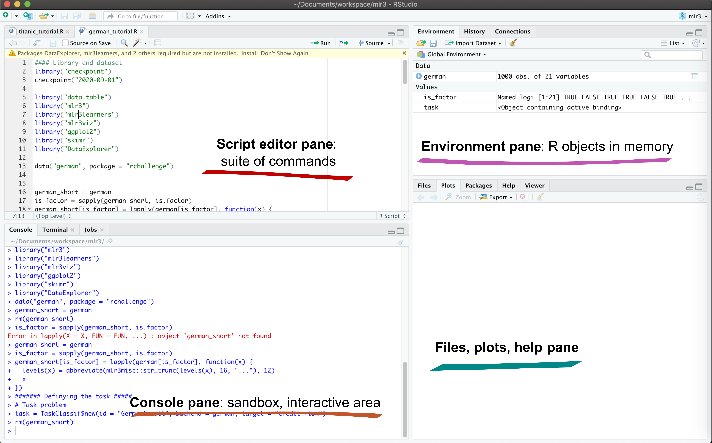
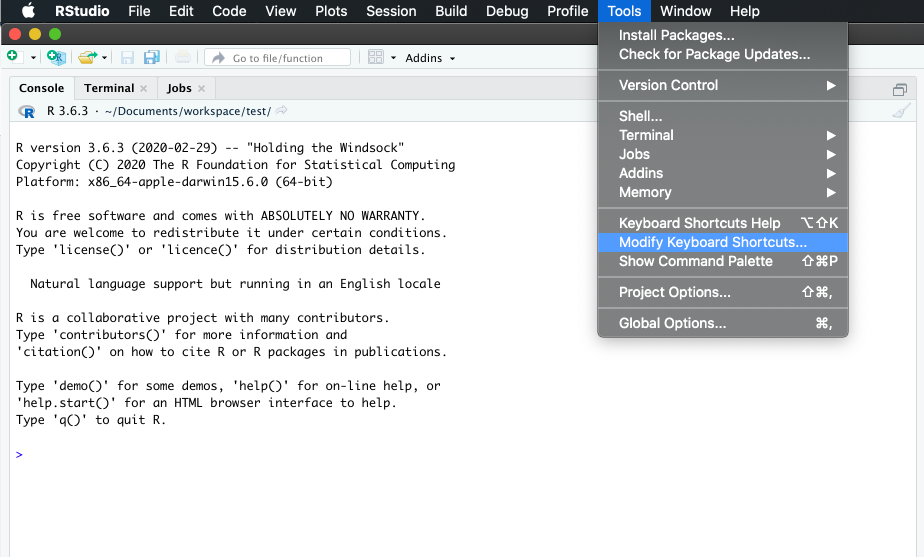
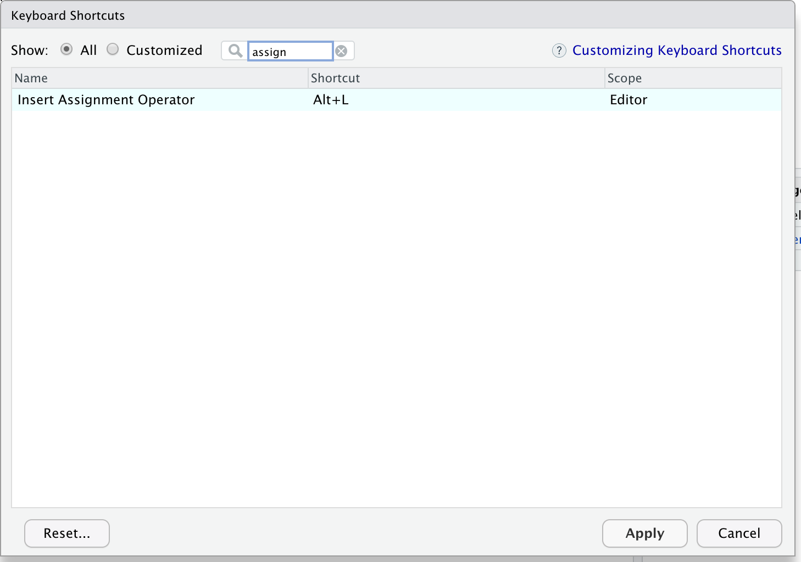
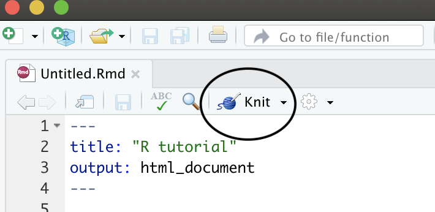
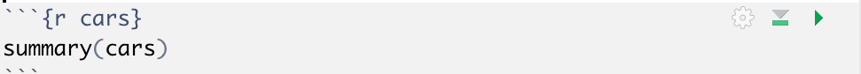
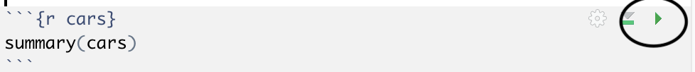
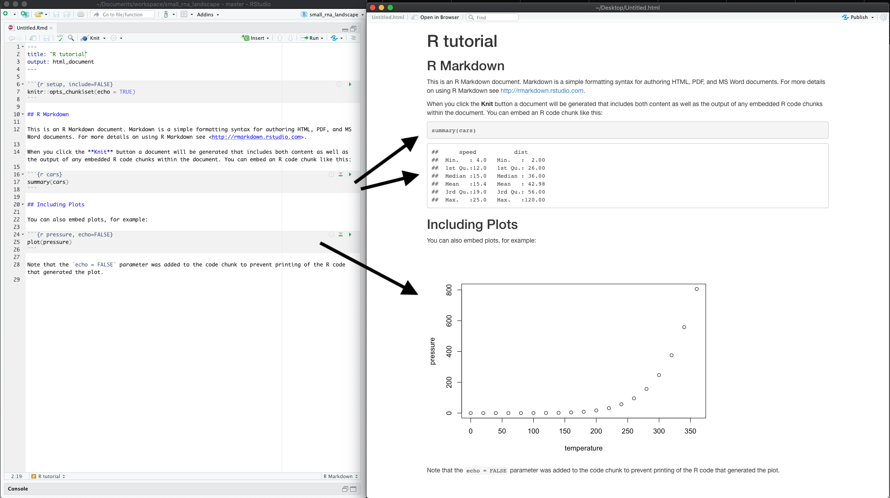
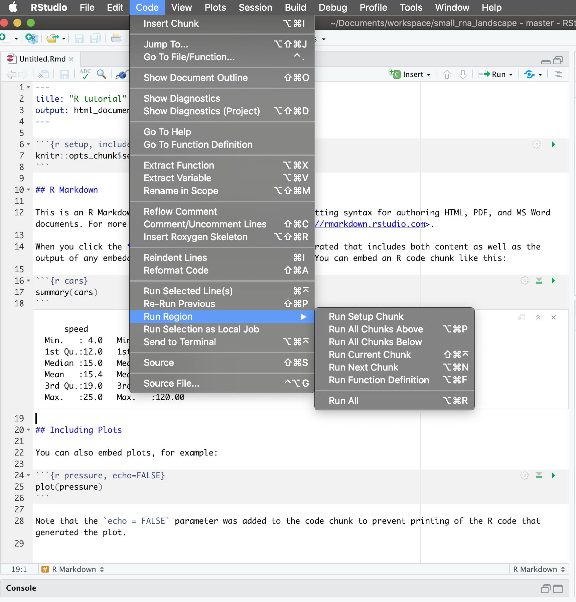
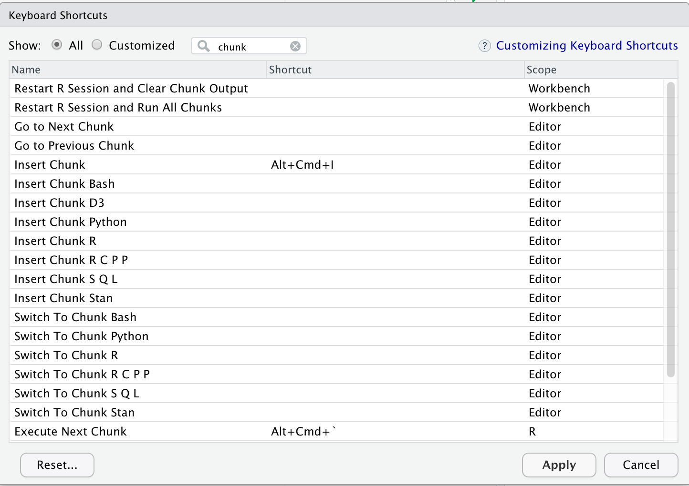

# Table of Contents

<!-- MarkdownTOC autolink="true" levels="1,2,3" -->

- [1. Introduction](#1-introduction)
	- [1.1 The R Markdown format](#11-the-r-markdown-format)
	- [1.2 Why learn R with RStudio?](#12-why-learn-r-with-rstudio)
- [2. A quick touR](#2-a-quick-tour)
	- [2.1 RStudio panes](#21-rstudio-panes)
	- [2.2 Locating yourself](#22-locating-yourself)
	- [2.3 First step in the console](#23-first-step-in-the-console)
	- [2.4 Make your life easier with keyboard shortcuts](#24-make-your-life-easier-with-keyboard-shortcuts)
	- [2.5 Error messages are your friends](#25-error-messages-are-your-friends)
	- [2.6 Logical operators and expressions](#26-logical-operators-and-expressions)
	- [2.7 Variable assignment](#27-variable-assignment)
- [3. Diving deepeR](#3-diving-deeper)
	- [3.1 Functions and help pages](#31-functions-and-help-pages)
	- [3.2 Packages](#32-packages)
	- [3.3 Clearing the environment](#33-clearing-the-environment)
- [4. R Markdown notebook](#4-r-markdown-notebook)
	- [4.1 R Markdown video \(1-minute\)](#41-r-markdown-video-1-minute)
	- [4.2 Create a R Markdown document](#42-create-a-r-markdown-document)
	- [4.3 The YAML header](#43-the-yaml-header)
	- [4.4 Code chunks](#44-code-chunks)
	- [4.5 Text markdown syntax](#45-text-markdown-syntax)
	- [4.6 Compile your R Markdown document](#46-compile-your-r-markdown-document)
	- [4.7 Useful tips and common issues](#47-useful-tips-and-common-issues)
- [5. Import your own data](#5-import-your-own-data)
	- [5.1 Functions available](#51-functions-available)
	- [5.2 Important tips](#52-important-tips)
	- [5.2 Large tables](#52-large-tables)
- [6. Credits and additional resources](#6-credits-and-additional-resources)
	- [6.1 Jenny Bryan](#61-jenny-bryan)
	- [6.2 RStudio materials](#62-rstudio-materials)
	- [6.3 The definitive R Markdown guide](#63-the-definitive-r-markdown-guide)
	- [6.4 Others](#64-others)

<!-- /MarkdownTOC -->


# 1. Introduction

<br> 
This episode is focusing on the concept of **literate programming** supported by the ability to combine code, its output and human-readable descriptions in a single R Markdown document.

> ## Literate programming
> More generally, the mixture of code, documentation (conclusion, comments) and figures in a notebook is part of the so-called __"literate programming"__ paradigm (Donald Knuth, 1984). Your code and logical steps should be understandable for human beings. In particular these four tips are related to this paradigm:
> - Do not write your program only for R but think also of code readers (that includes you).
> - Focus on the logic of your workflow. Describe it in plain language (e.g. English) to explain the steps and why you are doing them.
> - Explain the "why" and not the "how".
> - Create a report from your analysis using a R Markdown notebook to wrap together the data + code + text.    
{: .callout}

## 1.1 The R Markdown format

> ## Leave your mark
R Markdown allows you to convert your complete analysis into a single report that is easy to share and that should recapitulate the logic of your code and related outputs.   
A variety of output formats are supported:
* Word document
* Powerpoint
* HTML
* PDF
{: .callout}

  

In practice, it is best practice to create a **PDF document** from your analysis as PDF documents are easy to open and visualise online especially on GitHub. 


## 1.2 Why learn R with RStudio?

You are all here today to learn how to code. Coding made me a better scientist because I was able to think more clearly about analyses, and become more efficient in doing so. Data scientists are creating tools that make coding more intuitive for new coders like us, and there is a wealth of awesome instruction and resources available to learn more and get help.

Here is an analogy to start us off. **Think of yourself as a pilot, and R is your airplane.** You can use R to go places! With practice you'll gain skills and confidence; you can fly further distances and get through tricky situations. You will become an awesome pilot and can fly your plane anywhere. 

And **if R were an airplane, RStudio is the airport**. RStudio provides support! Runways, communication, community, and other services that makes your life as a pilot much easier. So it's not only the infrastructure (the user interface or IDE), although it is a great way to learn and interact with your variables, files, and interact directly with GitHub. It's also a data science philosophy, R packages, community, and more. So although you can fly your plane without an airport and we could learn R without RStudio, that's not what we're going to do. 

> ## Take-home message
> We are learning R together with RStudio because it offers the power of a programming language with the comfort of an Integrated Development Environment. 
{: .callout}

Something else to start us off is to mention that you are learning a new language here. It's an ongoing process, it takes time, you'll make mistakes, it can be frustrating, but it will be overwhelmingly awesome in the long run. We all speak at least one language; it's a similar process, really. And no matter how fluent you are, you'll always be learning, you'll be trying things in new contexts, learning words that mean the same as others, etc, just like everybody else. And just like any form of communication, there will be miscommunications that can be frustrating, but hands down we are all better off because of it. 

While language is a familiar concept, programming languages are in a different context from spoken languages, but you will get to know this context with time. For example: you have a concept that there is a first meal of the day, and there is a name for that: in English it's "breakfast". So if you're learning Spanish, you could expect there is a word for this concept of a first meal. (And you'd be right: 'desayuno'). **We will get you to expect that programming languages also have words (called functions in R) for concepts as well**. You'll soon expect that there is a way to order values numerically. Or alphabetically. Or search for patterns in text. Or calculate the median. Or reorganize columns to rows. Or subset exactly what you want. We will get you increase your expectations and learn to ask and find what you're looking for.

<br> 

# 2. A quick touR

## 2.1 RStudio panes

Like a medieval window, RStudio has several panes (sections that divide the entire window). 


Launch RStudio/R and identify the different panes. 



Notice the default panels:

  * Script editor panel (upper left)
  * Console (lower right)
  * Environment/History (tabbed in upper right)
  * Files/Plots/Packages/Help (tabbed in lower right)

> ## Customizing RStudio appearance
> You can change the default location of the panes, among many other things: [Customizing RStudio](https://support.rstudio.com/hc/en-us/articles/200549016-Customizing-RStudio). 
{: .callout}


## 2.2 Locating yourself

An important first question: **where are we inside the computer file system?**  

If you've have opened RStudio for the first time, you'll be in your home directory. This is noted by the `~/` at the top of the console. You can see too that the `Files` pane in the lower right shows what is in the home directory where you are. You can navigate around within that `Files` pane and explore, but note that you won't change where you are: even as you click through you'll still be Home: `~/`. 


## 2.3 First step in the console

OK let's go into the Console, where we interact with the live R process.

Make an assignment and then inspect the object you created by typing its name on its own.

~~~
x <- 3 * 4
x
~~~
{: .language-r}

In my head, I hear e.g., "x gets 12".

All R statements where you create objects -- "assignments" -- have this form: `objectName <- value`.  

I'll write it in the console with a hashtag `#`, which is the way R comments so it won't be evaluated. 
~~~
## objectName <- value

## This is also how you write notes in your code to explain what you are doing.
~~~
{: .language-r}

Object names cannot start with a digit and cannot contain certain other characters such as a comma or a space. You will be wise to adopt a [convention for demarcating words](http://en.wikipedia.org/wiki/Snake_case) in names.

~~~
# i_use_snake_case
# other.people.use.periods
# evenOthersUseCamelCase
~~~
{: .language-r}

Make an assignment
~~~
this_is_a_really_long_name <- 2.5
~~~
{: .language-r}

To inspect this variable, instead of typing it, we can press the up arrow key and call your command history, with the most recent commands first. Let's do that, and then delete the assignment: 

~~~
this_is_a_really_long_name
~~~
{: .language-r}

Another way to inspect this variable is to begin typing `this_`...and RStudio will automagically have suggested completions for you that you can select by hitting the tab key, then press return. 

One more:
~~~
science_rocks <- "yes it does!"
~~~
{: .language-r}

You can see that we can assign an object to be a word, not a number. In R, this is called a "string", and R knows it's a word and not a number because it has quotes `" "`. You can work with strings in your data in R pretty easily, thanks to the [`stringr`](http://stringr.tidyverse.org/) and [`tidytext`](https://github.com/juliasilge/tidytext#tidytext-text-mining-using-dplyr-ggplot2-and-other-tidy-tools) packages. We won't talk about strings very much specifically, but know that R can handle text, and it can work with text and numbers together (this is a huge benefit of using R). 

Let's try to inspect:
~~~
sciencerocks
# Error: object 'sciencerocks' not found
~~~
{: .language-r}

## 2.4 Make your life easier with keyboard shortcuts

One can rapidly experience that typing the *assign* operator `<-` is laborious to type in the long run. Instead, we can create a keyboard shortcut to make our life easier.    

With RStudio, this is relatively straightforward. Follow the screenshots to change the default to `Alt + L` for instance. 

Go to "Tools" followed by "Modify Keyboard Shortcuts":  



Then in the "Filter" text box, type "assign" to find the current keyboard shortcut for the assign operator. Change it to `Alt + L` or any other convenient key combination.   




> ## Lovely keyboard shortcuts: 
> RStudio offers many handy [keyboard shortcuts](https://support.rstudio.com/hc/en-us/articles/200711853-Keyboard-Shortcuts).   
> Also, `Alt + Shift + K` brings up a keyboard shortcut reference card.
{: .testimonial}

## 2.5 Error messages are your friends

Implicit contract with the computer / scripting language: Computer will do tedious computation for you. In return, you will be completely precise in your instructions. Typos matter. Case matters. Pay attention to how you type.

Remember that this is a language, not unsimilar to English! There are times you aren't understood -- it's going to happen. There are different ways this can happen. Sometimes you'll get an error. This is like someone saying 'What?' or 'Pardon'? Error messages can also be more useful, like when they say 'I didn't understand what you said, I was expecting you to say blah'. That is a great type of error message. Error messages are your friend. Google them (copy-and-paste!) to figure out what they mean. 


And also know that there are errors that can creep in more subtly, when you are giving information that is understood, but not in the way you meant. Like if I am telling a story about suspenders that my British friend hears but silently interprets in a very different way (true story). This can leave me thinking I've gotten something across that the listener (or R) might silently interpreted very differently. And as I continue telling my story you get more and more confused... Clear communication is critical when you code: write clean, well documented code and check your work as you go to minimize these circumstances!

## 2.6 Logical operators and expressions

A moment about **logical operators and expressions**. We can ask questions about the objects we made. 

- `==` means 'is equal to'
- `!=` means 'is not equal to'
- `<` means 'is less than'
- `>` means 'is greater than'
- `<=` means 'is less than or equal to'
- `>=` means 'is greater than or equal to'  

~~~
x == 2
x <= 30
x != 5
~~~
{: .language-r}

## 2.7 Variable assignment

Let's assign a number to a variable called `weight_kg`.
~~~
weight_kg <- 55    # doesn't print anything
(weight_kg <- 55)  # but putting parenthesis around the call prints the value of `weight_kg`
weight_kg          # and so does typing the name of the object
~~~
{: .language-r}


When assigning a value to an object, R does not print anything. You can force R to print the value by using parentheses or by typing the object name:


Now that R has `weight_kg` in memory, we can do arithmetic with it. For
instance, we may want to convert this weight into pounds (weight in pounds is 2.2 times the weight in kg):

~~~
weight_kg * 2.2
~~~
{: .language-r}

We can also change a variable's value by assigning it a new one:

~~~
weight_kg <- 57.5
weight_kg * 2.2
~~~
{: .language-r}

And when we multiply it by 2.2, the outcome is based on the value currently assigned to the variable.  

OK, let's store the animal's weight in pounds in a new variable, `weight_lb`:

~~~
weight_lb <- weight_kg * 2.2
~~~
{: .language-r}

and then change `weight_kg` to 100.

~~~
weight_kg <- 100
~~~
{: .language-r}

What do you think is the current content of the object `weight_lb`? 126.5 or 220? Why? 
It's 125.6. Why? Because assigning a value to one variable does not change the values of
other variables — if you want `weight_kg` updated to reflect the new value for `weight_lb`, you will have to re-execute that code. This is why we re-comment working in scripts and documents rather than the Console, and will introduce those concepts shortly and work there for the rest of the day.

We can create a vector of multiple values using `c()`.
~~~
c(weight_lb, weight_kg)

names <- c("Jamie", "Melanie", "Julie")
names
~~~
{: .language-r}

> ## Exercise
>
>  1. Create a vector that contains the different weights of four fish (you pick the object name!): 
> - one fish: 12 kg  
> - two fish: 34 kg  
> - red fish: 20 kg   
> - blue fish: 6.6 kg 
> 2. Convert the vector of kilos to pounds (hint: 1 kg = 2.2 pounds).  
> 3. Calculate the total weight.
> 
> > ## Solution
> > ~~~
> > # Q1 
> > fish_weights <- c(12, 34, 20, 6.6)
> > # Q2
> > fish_weights_lb <- fish_weights * 2.2
> > # Q3
> > # we haven't gone over functions like `sum()` yet but this is covered in the next section. 
> > sum(fish_weights_lb) 
> > ~~~
> > {: .language-r}
> {: .solution}
{: .challenge}  

<br>

# 3. Diving deepeR 

## 3.1 Functions and help pages

R has a mind-blowing collection of built-in functions that are used with the same syntax: function name with parentheses around what the function needs to do what it is supposed to do.  

`function_name(argument1 = value1, argument2 = value2, ...)`. When you see this syntax, we say we are "calling the function".

Let's try using `seq()` which makes regular sequences of numbers and, while we're at it, demo more helpful features of RStudio.

Type `se` and hit TAB. A pop up shows you possible completions. Specify `seq()` by typing more to disambiguate or using the up/down arrows to select. Notice the floating tool-tip-type help that pops up, reminding you of a function's arguments. If you want even more help, press F1 as directed to get the full documentation in the help tab of the lower right pane. 

Type the arguments `1, 10` and hit return. 
~~~
seq(1, 10)
~~~
{: .language-r}

We could probably infer that the `seq()` function makes a sequence, but let's learn for sure. Type (and you can autocomplete) and let's explore the help page:

~~~
?seq 
help(seq) # same as ?seq
~~~
{: .language-r}

> ## Help page
>
> The help page tells the name of the package in the top left, and broken down into sections:
> - **Description:** An extended description of what the function does.
> - **Usage:** The arguments of the function and their default values.
> - **Arguments:** An explanation of the data each argument is expecting.
> - **Details:** Any important details to be aware of.
> - **Value:** The data the function returns.
> - **See Also:** Any related functions you might find useful.
> - **Examples:** Some examples for how to use the function.
{: .callout}

~~~
seq(from = 1, to = 10) # same as seq(1, 10); R assumes by position
seq(from = 1, to = 10, by = 2)
~~~
{: .language-r}

The above also demonstrates something about how R resolves function arguments. You can always specify in `name = value` form. But if you do not, R attempts to resolve by position. So above, it is assumed that we want a sequence `from = 1` that goes `to = 10`. Since we didn't specify step size, the default value of `by` in the function definition is used, which ends up being 1 in this case. For functions I call often, I might use this resolve by position for the first
argument or maybe the first two. After that, I always use `name = value`.

The examples from the help pages can be copy-pasted into the console for you to understand what's going on. Remember we were talking about expecting there to be a function for something you want to do? Let's try it. 

> ## Exercise
>
> Talk to your neighbor(s) and look up the help file for a function that you know or expect to exist. Here are some ideas: 
> 1. `?getwd()`
> 2. `?plot()`
> 3. `min()`
> 4. `max()`
> 5. `?mean()`
> 6. `?log()`)
>
> > ## Solution
> > 1. Gets and prints the current working directory.
> > 2. Plotting function.
> > 3. Minimum value in a vector or dataframe column.
> > 4. Maximum value in a vector or dataframe column.
> > 5. Geometric mean (average) of a vector or dataframe column. Generic function for the (trimmed) arithmetic mean.
> > 6. Logarithm function. Specific functions exist for log2 and log10 calculations. 
> {: .solution}
{: .challenge}

And there's also help for when you only sort of remember the function name: double-question mark:
~~~
??install 
~~~
{: .language-r}


Not all functions have (or require) arguments:
~~~
date()
~~~
{: .language-r}

## 3.2 Packages

So far we've been using a couple functions from base R, such as `seq()` and `date()`. But, one of the amazing things about R is that a vast user community is always creating new functions and packages that expand R's capabilities. In R, the fundamental unit of shareable code is the package. A package bundles together code, data, documentation, and tests, and is easy to share with others. They increase the power of R by improving existing base R functionalities, or by adding new ones. 

The traditional place to download packages is from CRAN, the [Comprehensive R Archive Network](https://cran.r-project.org/), which is where you downloaded R. You can also install packages from GitHub, which we'll do tomorrow.

You don't need to go to CRAN's website to install packages, this can be accomplished within R using the command `install.packages("package-name-in-quotes")`. Let's install a small, fun package `praise`. You need to use quotes around the package name.:

~~~
install.packages("praise")
~~~
{: .language-r}

Now we've installed the package, but we need to tell R that we are going to use the functions within the `praise` package. We do this by using the function `library()`.

**What’s the difference between a package and a library?**  
Sometimes there is a confusion between a package and a library, and you can find people calling “libraries” to packages.

Please don’t get confused: `library()` is the command used to load a package, and it refers to the place where the package is contained, usually a folder on your computer, while a package is the collection of functions bundled conveniently.

~~~
library(praise)
~~~
{: .language-r}

Now that we've loaded the `praise` package, we can use the single function in the package, `praise()`, which returns a randomized praise to make you feel better.

~~~
praise()
~~~
{: .language-r}


## 3.3 Clearing the environment

Now look at the objects in your environment (workspace) -- in the upper right pane. The workspace is where user-defined objects accumulate. 


You can also get a listing of these objects with a few different R commands:

~~~
objects()
ls()
~~~
{: .language-r}

If you want to remove the object named `weight_kg`, you can do this:

~~~
rm(weight_kg)
~~~
{: .language-r}

To remove everything:

~~~
rm(list = ls())
~~~
{: .language-r}

or click the broom 🧹 in RStudio Environment panel.

For reproducibility, it is critical that you delete your objects and restart your R session frequently. You don't want your whole analysis to only work in whatever way you've been working right now — you need it to work next week, after you upgrade your operating system, etc. Restarting your R session will help you identify and account for anything you need for your analysis. 

We will keep coming back to this theme but let's restart our R session together: Go to the top menus: *Session* > *Restart R*. 

> ## Exercise
>
> Clear your workspace and create a few new variables.
> Create a variable that is the mean of a sequence of 1-20. 
> 1. What's a good name for your variable?
> 2. Does it matter what your "by" argument is? Why?
>
> > ## Solution
> > 1. Any meaningful and relatively short name is good. As a suggestion `mean_seq` could work.
> > 2. Yes it does. By default "by" is equal to 1 but it can be changed to any increment number.
> {: .solution}
{: .challenge}

# 4. R Markdown notebook

R Markdown will allow you to create your own workflow, save it and generate a high quality report that you can share. It supports collaboration and reproducibility of your work. 
This is really key for collaborative research, so we're going to get started with it early and then use it for the rest of the day. 

> ## Literate programming
> More generally, the mixture of code, documentation (conclusion, comments) and figures in a notebook is part of the so-called __"literate programming"__ paradigm (Donald Knuth, 1984). Your code and logical steps should be understandable for human beings. In particular these four tips are related to this paradigm:
> - Do not write your program only for R but think also of code readers (that includes you).
> - Focus on the logic of your workflow. Describe it in plain language (e.g. English) to explain the steps and why you are doing them.
> - Explain the "why" and not the "how".
> - Create a report from your analysis using a R Markdown notebook to wrap together the data + code + text.    
{: .callout}

## 4.1 R Markdown video (1-minute)

<div style="padding:62.5% 0 0 0;position:relative;"><iframe src="https://player.vimeo.com/video/178485416?color=428bca" style="position:absolute;top:0;left:0;width:100%;height:100%;" frameborder="0" allow="autoplay; fullscreen; picture-in-picture" allowfullscreen></iframe></div><script src="https://player.vimeo.com/api/player.js"></script>
<p><a href="https://vimeo.com/178485416">What is R Markdown?</a> from <a href="https://vimeo.com/rstudioinc">RStudio, Inc.</a> on <a href="https://vimeo.com">Vimeo</a>.</p>
<p>A minute long introduction to R Markdown</p>


This is also going to introduce us to the fact that RStudio is a sophisticated text editor (among all the other awesome things). You can use it to keep your files and scripts organized within one place (the RStudio IDE) while getting support that you expect from text editors (check-spelling and color, to name a few).

An R Markdown file will allow us to weave markdown text with chunks of R code to be evaluated and output content like tables and plots.


## 4.2 Create a R Markdown document

To do so, go to:
*File* -> *New File* -> *R Markdown*... -> Document of output format HTML -> click OK.


You can give it a Title like "R tutorial". Then click OK. 




Let's have a look at this file — it's not blank; there is some initial text is already provided for you. You can already notice a few parts: 

- A document __YAML header__,
- Usually many different __code chunks__,
- and __formatted text__ and __various outputs__ (figures, tables)


## 4.3 The YAML header


The header of your R Markdown document will allow you to personalize the related report from your R Markdown document.  
The header follows the YAML syntax ("YAML Ain't Markup Language") which usually follows a key:value syntax.   

A few YAML parameters are all you need to know to start using R Markdown. Here is an opinionated list of the key parameters:

~~~
---
- title: "R tutorial"
- output: html_document 
- author: "John Doe"
- date: "Tuesday, February 15 2021"
---
~~~
{: .language-yaml}

The three dashes `---` before and after the `option: value` are important to delimit the YAML header. Do not forget them! 

A note on output format: if you search online, you will find tons of potential output formats available from one R Markdown document. Some of them require additional packages or software installation. For instance, compiling your document to produce a PDF will require LaTeX libraries etc. 

> ## Exercise
> Open the output formats of the R Markdown definitive guide: [https://bookdown.org/yihui/rmarkdown/output-formats.html](https://bookdown.org/yihui/rmarkdown/output-formats.html).  
> Instead of `output: html_document`, specify `pdf_document` to compile into a PDF (because it is easier to share for instance).  
> Press the knit button. Is it working? If not, what is missing?
{: .challenge}

For PDF, you might need to install a distribution of LaTeX for which several options exist. The recommended one is to install [TinyTeX from Yihui Xie](https://yihui.name/tinytex/). Other more comprehensive LaTeX distributions can be obtained from the [LaTeX project directly for your OS](https://www.latex-project.org/get/).  

If you feel adventurous, you can try other formats. There are many things you can generate from a R Markdown document even slides for a presentation. 

> ## Exercise
> Instead of hard-coding the date in the YAML section, search online for a way to dynamically have the today's date.
> > ## Solution
> > In the YAML header, write:  
> > `date: r Sys.Date()`  
> > This will add today's date in the YYYY-MM-DD format when compiling.    
> {: .solution}
{: .challenge}

More generally, you can use the syntax `option: r <some R command>` to have options automatically updated by some R command when 
compiling your R Markdown notebook into a report.  


## 4.4 Code chunks

Code chunks appear in grey and will execute the R code when you compile the document. 
The following chunk will create a summary of the `cars` dataframe. 



A code chunk is defined by three backticks ```` ```{r} ````  before curly braces with `r` inside to indicate the coding language.  
It is closed by three backticks ```` ``` ````.

~~~
```{r}
summary(cars)
```
~~~
{: .language-r}

The code chunk will be executed when compiling the report. You can also run it by clicking on the green arrow. 



To insert a new code chunk, you can either:
1. Use a keyboard shortcut:  `Ctrl + Alt + I`: to add a code chunk. Use `Cmd + Alt + I` on Mac OS.  
2. Click on "Add chunk in the toolbar. "  
3. Place two code chunk: ```` ```{r} ```` to open the code chunk and ```` ``` ```` to close it. 


> ## Exercise
> Introduce a new code chunk to produce a histogram of the cars speed.   
> Compile your R Markdown document and visualise the results.  
> In the final document, can you find a way to hide the code chunk that generates the plot? 
> > ## Solution
> > Add a new code chunk:  
> > ~~~
> > ```{r}
> > hist(cars$speed)
> > ```
> > ~~~
> > {: .language-r}
> > 
> > Inside the curly braces, add:  
> > ~~~
> > ```{r, echo = FALSE}
> > hist(cars$speed)
> > ```
> > ~~~
> > {: .language-r}
> {: .solution}
{: .challenge}


## 4.5 Text markdown syntax

You might wonder what the "markdown" in R Markdown stands for.   

Between code chunks, you can write normal plain text to comment figures and code outputs. To format titles, paragraphs, format text in italics, etc. you can make use of the __markdown syntax__ that is a simple but efficient method to format text. Altogether, it means that a R Markdown document has 2 different languages within it: **R** and **Markdown**. 

Markdown is a formatting language for plain text, and there are only about 15 rules to know. 

Have a look at your own document. Notice the syntax for:

- **headers** get rendered at multiple levels: `#`, `##`
- **bold**: `**word**`
- **Web links**: `<http://rmarkdown.rstudio.com>` or `[http://rmarkdown.rstudio.com](http://rmarkdown.rstudio.com).`.
- **In line code**: see the `echo = FALSE`

There are some good [cheatsheets](https://github.com/adam-p/markdown-here/wiki/Markdown-Here-Cheatsheet) to get you started, and here is one built into RStudio: Go to Help > Markdown Quick Reference


> ## Exercise
>
> In Markdown: 
> 1. Format text in italics, 
> 2. Make a numbered list, 
> 3. Add a web link to the RStudio website in your document, 
> 4. Add a "this is a subheader" subheader with the level 2 or 3.    
> Reknit your document.  
>
> > ## Solution
> > 1. Add one asterisk or one underscore on both sides of the text.    
> > 2. To make a numbered list, write `1.` then add a line and write a second `2.`. 
> > 3. Place the link between squared brackets. [RStudio link](https://www.rstudio.com/)
> > 4. Subheaders can be written with `###` or `##` depending on the level that you want to write.
> {: .solution}
{: .challenge}

A complete but short guide on Markdown syntax from Yihui Xie is available [here](https://bookdown.org/yihui/rmarkdown/markdown-syntax.html).


## 4.6 Compile your R Markdown document

Now that we are all set, we can compile the document to generate the corresponding HTML document. Press the "Knit" button.


This will compile your R Markdown document and open a new window. 



What do you notice between the two? So much of learning to code is looking for patterns.

Notice how the grey **R code chunks** are surrounded by 3 backticks and `{r LABEL}`. These are evaluated and return the output text in the case of `summary(cars)` and the output plot in the case of `plot(pressure)`.

Notice how the code `plot(pressure)` is not shown in the HTML output because of the R code chunk option `echo=FALSE`. 

> ## Compiling takes place in a separate R workspace
> When compiling, you will be redirected to the R Markdown tab next to your Console. 
> This is normal as your R Markdown document is compiled in a separate new R workspace. 
{: .callout}


## 4.7 Useful tips and common issues

Here is a list of useful keyboard shortcuts: 

> ## Useful shortcuts
> Place the cursor in the script editor pane. Then type:   
> - `Ctrl + Alt + I`: to add a code chunk. 
> - `Ctrl + Shift + K`: compile the R Markdown document to create the related output. 
> - `Ctrl + Alt + C` to run the current code chunk (your cursor has to be inside a code chunk).
> - `Ctrl + Alt + R`
> 
> For Mac OS users, replace `Ctrl` with `Cmd` (Command). 
{: .testimonial}

All these shortcuts can be seen in _Code_  > _Run Region_ > ...   



As seen before, you can modify these shortcuts to anything you find convenient: _Tools_ > _Modify keyboard shortcuts_.   
Type "chunk" to filter the shortcuts for code chunks. 



> ## Common issues
> Separate workspace when compiling
> When you compile your R Markdown document, it will start from a _clean_ R workspace. 
> Anything you have in your current R interactive session _will not_ be available in the R Markdown tab. 
{: .callout}

This is often the source of bugs and halting

> ## Exercise
> **Step 1:** In the **R console**, type:
> ~~~
> library(dplyr)   
> tooth_filtered <- dplyr::filter(ToothGrowth, len > 1) 
> ~~~
> {: .language-r}
> You should see the `tooth_filtered` R object in your current environment.  
>      
> **Step 2**: in your **R Markdown** document, add this line:
> > ~~~
> > with(tooth_filtered, hist(x = len, col = "darkgrey"))
> > ~~~
> > {: .language-r} 
> > Try to knit your document. What bug do you experience?
> > ## Solution
> > Since your R Markdown workspace starts from scratch and creates a new environment, it ignores the `tooth_filtered` object you created in your R console.  
> > The solution is to add the `tooth_filtered <- dplyr::filter(ToothGrowth, len > 1) ` line inside a code chunk. 
> {: .solution}
{: .challenge} 

<br> 

# 5. Import your own data

## 5.1 Functions available

To import your own data, you can use different functions depending on your input format:
* `read.table` is the generic function to import from various format. You _do have to_ specify the separator as it is not known by default (tabulation or comma for instance).
* `read.csv` to import a table with comma-separated values (`my_file.csv`). You don't have to specify the separator as it is by default a comma.
* `read.delim` to import a table with tabulated-separated values (`my_file.tsv` or `my_file.txt`). You don't have to specify the separator as it is by default a tabulation.


Some important parameters in data import functions:
* `stringsAsFactors = TRUE` is by default converting your characters into factors. This can be an issue for plotting for instance. I recommend to turn it off (`stringsAsFactors = FALSE` and change your strings to factors explicitely later on using `factor()` for instance.
* `check.names = TRUE` is by default checking your column names. For instance, if your column names start with a number, then R will prepend an `X` before your column variable name. To avoid this, add `check.names = FALSE`.

## 5.2 Important tips 

Taken from [Anna Krystalli workshop](https://annakrystalli.me/rrresearch/02_RDM_intro.html#18):

__`read.csv`__
~~~
read.csv(file, 
	     na.strings = c("NA", "-999"), 
         strip.white = TRUE, 
         blank.lines.skip = TRUE, 
         fileEncoding = "mac")
~~~
{: .language-r}

- `na.string`: character vector of values to be coded missing and replaced with NA to argument eg
- `strip.white`: Logical. if TRUE strips leading and trailing white space from unquoted character fields
- `blank.lines.skip`: Logical: if TRUE blank lines in the input are ignored.
- `fileEncoding`: if you're getting funny characters, you probably need to specify the correct encoding.


## 5.2 Large tables

If you have very large tables (1000s of rows and/or columns), use the `fread()` function from the [data.table](https://cran.r-project.org/web/packages/data.table/vignettes/datatable-intro.html) package. 

<br> 

# 6. Credits and additional resources

## 6.1 Jenny Bryan 

* Stat 545 University module: https://stat545.com/
* Main website: https://jennybryan.org/

## 6.2 RStudio materials
- The official RStudio R Markdown documentation: [https://rmarkdown.rstudio.com/](https://rmarkdown.rstudio.com/)
- The [RStudio R Markdown cheatsheet](https://rstudio.com/wp-content/uploads/2016/03/rmarkdown-cheatsheet-2.0.pdf)

## 6.3 The definitive R Markdown guide
"The R Markdown definitive guide" by Yihui Xie, J. J. Allaire and Garrett Grolemund: [https://bookdown.org/yihui/rmarkdown/](https://bookdown.org/yihui/rmarkdown/)

## 6.4 Others
- Remedy: additional functionalities for markdown in RStudio: [https://thinkr-open.github.io/remedy/](https://thinkr-open.github.io/remedy/)
- R Markdown Crash Course: a very complete course on R Markdown.  [https://zsmith27.github.io/rmarkdown_crash-course/](https://zsmith27.github.io/rmarkdown_crash-course/)

<br>