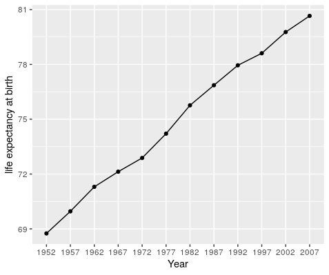

<!-- MarkdownTOC autolink="true" levels="1,2,3" -->

- [1. Introduction](#1-introduction)
    - [1.1 Load packages](#11-load-packages)
  - [1.2 The wide gapminder dataset.](#12-the-wide-gapminder-dataset)
  - [1.3 Setup](#13-setup)
- [2. From messy to tidy with `pivot_longer()`](#2-from-messy-to-tidy-with-pivot_longer)
  - [2.1 The tidy data format](#21-the-tidy-data-format)
  - [2.2 Simple example of `pivot_longer()` usage](#22-simple-example-of-pivot_longer-usage)
    - [2.2.1 Data import](#221-data-import)
    - [2.2.2 Identifying the problematic columns](#222-identifying-the-problematic-columns)
    - [2.2.3 Pivoting the dataframe](#223-pivoting-the-dataframe)
    - [2.2.4 Cleaning when pivoting](#224-cleaning-when-pivoting)
  - [2.3 More advanced usage of `pivot_longer()`](#23-more-advanced-usage-of-pivot_longer)
    - [2.3.1 Back to the complete `gap_wide` dataset](#231-back-to-the-complete-gap_wide-dataset)
    - [2.3.2 The `separate()` function](#232-the-separate-function)
- [3. Plotting tidy data](#3-plotting-tidy-data)
  - [3.1 One country 🇨🇦 and one variable](#31-one-country-%F0%9F%87%A8%F0%9F%87%A6-and-one-variable)
  - [3.2 One country and many variables](#32-one-country-and-many-variables)
- [4. Back to a compact wide format with `pivot_wider()`](#4-back-to-a-compact-wide-format-with-pivot_wider)
  - [4.1 The `pivot_wider()` function](#41-the-pivot_wider-function)
  - [4.2 From long to wide](#42-from-long-to-wide)
- [5. Bonus: the `complete()` function](#5-bonus-the-complete-function)
- [6. Resources and credits](#6-resources-and-credits)

<!-- /MarkdownTOC -->

 

# 1. Introduction

Now you have some experience working with tidy data and seeing the logic of wrangling when data are structured in a tidy way. But 'real' data often don't start off in a tidy way, and require some reshaping to become tidy. The `tidyr` package is for reshaping data. You won't use `tidyr` functions as much as you use `dplyr` functions, but it is incredibly powerful when you need it.

Why is this important? Well, if your data are formatted in a standard way, you will be able to use analysis tools that operate on that standard way. Your analyses will be streamlined and you won't have to reinvent the wheel every time you see data in a different way. 

To make a long story short:
> All messy datasets are messy in their own way but all tidy datasets look alike. 

### 1.1 Load packages

If not done already, load the tidyverse suite that contains `tidyr` and `dplyr`.
~~~
library(tidyverse)
~~~
{: .language-r}

## 1.2 The wide gapminder dataset.

Yesterday we started off with the gapminder data in a format that was already tidy. But what if it weren't? Let's look at a different version of those data. 

The gapminder dataset in the *wide* format is on GitHub: [https://github.com/carpentries-incubator/open-science-with-r/blob/gh-pages/data/gapminder_wide.csv](https://github.com/carpentries-incubator/open-science-with-r/blob/gh-pages/data/gapminder_wide.csv).

First have a look at the data. 

You can see there are a lot more columns than the version we looked at before. This format is pretty common, because it can be a lot more intuitive to *enter* data in this way.

Sometimes, as with the gapminder dataset, we have multiple types of observed data. It is somewhere in between the purely 'long' and 'wide' data formats: 

- 3 "ID variables": `continent`, `country`, `year`. 
- 3 "observation variables": `pop`,`lifeExp`,`gdpPercap`. 

It's pretty common to have data in this format in most cases despite not having ALL observations in 1 column, since all 3 observation variables have different units. But we can play with switching it to the *tidy*/long* format and *wide* to show what that means (i.e. long would be 4 ID variables and 1 observation variable).

## 1.3 Setup

OK let's get going. 

We'll learn `tidyr` in an R Markdown file within a GitHub repository so we can practice what we've learned so far. You can either continue from the same R Markdown, or begin a new one. 

**Here's what to do:**

1. Clear your workspace (Session > Restart R)
1. New File > R Markdown..., save it under the `gapminder-wrangle.Rmd` name. 
1. Write some comment: "Data wrangling with `tidyr`, which is part of the tidyverse. We are going to tidy some data!"

 

# 2. From messy to tidy with `pivot_longer()`

## 2.1 The tidy data format

Tidy data means all rows are an observation and all columns are variables.

Let's take a look at some examples.

Data are often entered in a *wide* format where each row is often a site/subject/patient and you have multiple observation variables containing the same type of data. 

An example of data in a *wide* format is the `AirPassengers` dataset which provides information on monthly airline passenger numbers from 1949-1960. You'll notice that each row is a single year and the columns are each month Jan - Dec. 

In the R console, type:
~~~
AirPassengers
~~~
{:.language-r}

~~~
     Jan Feb Mar Apr May Jun Jul Aug Sep Oct Nov Dec
1949 112 118 132 129 121 135 148 148 136 119 104 118
1950 115 126 141 135 125 149 170 170 158 133 114 140
1951 145 150 178 163 172 178 199 199 184 162 146 166
1952 171 180 193 181 183 218 230 242 209 191 172 194
1953 196 196 236 235 229 243 264 272 237 211 180 201
1954 204 188 235 227 234 264 302 293 259 229 203 229
1955 242 233 267 269 270 315 364 347 312 274 237 278
1956 284 277 317 313 318 374 413 405 355 306 271 306
1957 315 301 356 348 355 422 465 467 404 347 305 336
1958 340 318 362 348 363 435 491 505 404 359 310 337
1959 360 342 406 396 420 472 548 559 463 407 362 405
1960 417 391 419 461 472 535 622 606 508 461 390 432
~~~
{: .output}

This format is intuitive for data entry, but less so for data analysis. If you wanted to calculate the monthly mean, where would you put it? As another row? 

Often, data must be reshaped for it to become tidy data. What does that mean? There are four main verbs we'll use, which are essentially pairs of opposites:

- turn columns into rows: 
    * `gather()` if using `tidyr` < 1.0.0, 
    * `pivot_longer()` if using tidyr >= 1.0.0,
- turn rows into columns with:
    * `spread()` if using `tidyr` < 1.0.0,
    * `pivot_wider()` if using `tidyr` > 1.0.0 
- turn a character column into multiple columns with `separate()`,
- turn multiple character columns into a single column with `unite()`

You can use `spread()` and `gather()` to transform or reshape data between *wide* to *long* formats.

In this episode, we will use the more modern `pivot_wider()` and `pivot_longer()` equivalents which are the most up-to-date versions of `spread()` and `gather()`. 

## 2.2 Simple example of `pivot_longer()` usage

### 2.2.1 Data import
Read in the data from GitHub. Let's also read in the gapminder data (tidy format) so that we can use it to compare later on. 

~~~
## wide messy format
gap_wide <- readr::read_csv('https://raw.githubusercontent.com/carpentries-incubator/open-science-with-r/gh-pages/data/gapminder_wide.csv') 

## long tidy format
gapminder <- readr::read_csv('https://raw.githubusercontent.com/carpentries-incubator/open-science-with-r/gh-pages/data/gapminder.csv')
~~~
{:.language-r}

We will only keep data about the GDP per year in the `gap_wide` dataset. 
~~~
gap_wide_gdp <- gap_wide %>% select("continent", "country", starts_with("gdp"))
head(gap_wide_gdp)
~~~
{: .language-r}

Let's have a look:
~~~
head(gap_wide_gdp)
~~~
{:.language-r}

~~~
# A tibble: 6 x 14
  continent country gdpPercap_1952 gdpPercap_1957 gdpPercap_1962 gdpPercap_1967 gdpPercap_1972 gdpPercap_1977
  <chr>     <chr>            <dbl>          <dbl>          <dbl>          <dbl>          <dbl>          <dbl>
1 Africa    Algeria          2449.          3014.          2551.          3247.          4183.          4910.
2 Africa    Angola           3521.          3828.          4269.          5523.          5473.          3009.
3 Africa    Benin            1063.           960.           949.          1036.          1086.          1029.
4 Africa    Botswa…           851.           918.           984.          1215.          2264.          3215.
5 Africa    Burkin…           543.           617.           723.           795.           855.           743.
6 Africa    Burundi           339.           380.           355.           413.           464.           556.
# … with 6 more variables: gdpPercap_1982 <dbl>, gdpPercap_1987 <dbl>, gdpPercap_1992 <dbl>, gdpPercap_1997 <dbl>,
#   gdpPercap_2002 <dbl>, gdpPercap_2007 <dbl>
~~~
{: .output}

You can also visualise the different columns and their encoding. 
~~~
str(gap_wide_gdp)
~~~
{: .language-r}

### 2.2.2 Identifying the problematic columns

While wide format is nice for data entry, it's not nice for calculations. Some of the columns are a mix of variable (e.g. "gdpPercap") and data ("1952").  What if you were asked for the mean population after 1990 in Algeria? Possible, but ugly. But we know it doesn't need to be so ugly. Let's tidy it back to the format we've been using. 

> ## Discussion point
>
> **Question**: let's talk this through together. If we're trying to turn the `gap_wide_gdp` messy format into the `gapminder` tidy format, what structure does it have that we like? And what do we want to change?
>
> > ## Solution
> > - We like the continent and country columns. We won't want to change those. 
> > - We want 1 column identifying the variable name and 1 column for the data.
> > - The values of `gdpPercap` should be in its own column.
> > - Year should be a separate column. 
>{: .solution}
{: .discussion}

Let's convert `gap_wide_gdp` to a long format. We'll have to do this in 2 steps. The first step is to take all of those column names (e.g. `gdpPerCap_1970`) and make them a variable in a new column, and transfer the values into another column. Let's learn by doing. 

Let's have a look at `pivot_longer()`'s help: 
~~~
?pivot_longer
~~~
{:.language-r}  

~~~
pivot_longer(
  data,
  cols,
  names_to = "name",
  names_prefix = NULL,
  names_sep = NULL,
  names_pattern = NULL,
  names_ptypes = list(),
  names_repair = "check_unique",
  values_to = "value",
  values_drop_na = FALSE,
  values_ptypes = list()
)
~~~
{: .output}

Here is an explanation of the main arguments of `pivot_longer()` that you should know:
* `data`: this is the dataframe we will operate on. It will be `gap_wide` obviously.
* `cols`: the columns to pivot into longer format. Usually, it is easier to specify the columns that should not be selected with the `-` sign.
* `names_to`: this is the name of the new column that will contain the data stored in the column names of data.
* `values_to`: this is the name of the column to create from the data stored in cell values. 

### 2.2.3 Pivoting the dataframe

One way is to identify the columns for the `cols` argument of `pivot_longer()` is by name. Listing them explicitly can be a good approach if there are just a few. But in our case we have 14 columns. I'm not going to list them out here since there is way too much potential for error if I tried to list `gdpPercap_1952`, `gdpPercap_1957`, `gdpPercap_1962` and so on. But we could use some of `dplyr`'s awesome `starts_with()`helper function.

Here is how to do it. 
~~~
gap_gdp_long <- gap_wide_gdp %>% 
                pivot_longer(cols = starts_with("gdp"),  # columns to pivot
                             names_to = "year",          # name of a new column with the old column names
                             values_to = "gdpPercap")    # name of a new column with the values contained in the old columns
~~~
{:.language-r}

This is the end result:

~~~
head(gap_gdp_long)
~~~
{:.language-r}

~~~
 A tibble: 6 x 4
  continent country year             gdpPercap
  <chr>     <chr>   <chr>          <dbl>
1 Africa    Algeria gdpPercap_1952 2449.
2 Africa    Algeria gdpPercap_1957 3014.
3 Africa    Algeria gdpPercap_1962 2551.
4 Africa    Algeria gdpPercap_1967 3247.
5 Africa    Algeria gdpPercap_1972 4183.
6 Africa    Algeria gdpPercap_1977 4910.
~~~
{: .output}

We have reshaped our dataframe with one type of value per column and one value of GDP per capital (`gdpPercap`) per row. 

Success! And there is another way that is nice to use if your columns don't follow such a structured pattern: you can exclude the columns you *don't* want. **This is actually what is recommended as, in most cases, it is less error-prone and simpler to understand.**

Here we have specified that we wanted to pivot columns starting with a `gdp` string. Since the `continent` and `country` columns were already consistent with the tidy format, we can also exclude these two columns and pivot all others. 

~~~
gap_gdp_long <- gap_wide_gdp %>% 
                pivot_longer(cols = - c(continent, country), names_to = "year", values_to = "gdpPercap")
~~~
{: .language-r}

We explicitely exclude the two first columns to keep them in the same format. All other columns are then pivoted and split into `year` and `gdpPerCap`. 

> ## Tip
> This "excluding method" works particularly well on a dataframe with a lot of columns since you will always have a "identifier" columns over many measurement columns. **Again, this is the recommended way to pivot a dataframe.**
{: .callout} 

> ## Exercise 
> Using the `gap_wide` dataframe, keep only columns with the life expectancy values.    
> Step 1: select the columns and name your new dataframe `gap_wide_life`.  
> Step 2: use the excluding method `-c()` to exclude columns already in the tidy format and pivot all remaining columns.   
> Step 3: show the first 5 rows of your tidy long dataframe.  
> 
> > ## Solution
> > 
> > ~~~
> > gap_wide_life <- gap_wide %>% select("continent", "country", starts_with("life"))
> > gap_life_long <- gap_wide_life %>% pivot_longer(cols = - c(continent, country), names_to = "year", values_to = "lifeExp")
> > head(gap_life_long, n = 5)  
> > ~~~
> > {: .language-r} 
> {: .solution}
{: .challenge}

### 2.2.4 Cleaning when pivoting

Actually, the `year` column we have created when pivoting contains the `gdpPercap_` prefix before the year information. This is not very informative and can also impair the conversion of the column to a proper year format. 

This can be taken care of when pivoting:
~~~
gap_gdp_long <- gap_wide_gdp %>% 
  pivot_longer(cols = - c(continent, country), 
               names_to = "year", 
               values_to = "gdpPercap", 
               names_prefix = "gdpPercap_")
head(gap_gdp_long)
~~~
{: .language-r}

The `year` column now only contains the year value and nothing else. 
~~~
   continent country year  gdpPercap
   <chr>     <chr>   <chr>     <dbl>
 1 Africa    Algeria 1952      2449.
 2 Africa    Algeria 1957      3014.
 3 Africa    Algeria 1962      2551.
 4 Africa    Algeria 1967      3247.
 5 Africa    Algeria 1972      4183.
 6 Africa    Algeria 1977      4910.
 7 Africa    Algeria 1982      5745.
 8 Africa    Algeria 1987      5681.
 9 Africa    Algeria 1992      5023.
10 Africa    Algeria 1997      4797.
~~~
{: .output}

## 2.3 More advanced usage of `pivot_longer()`

### 2.3.1 Back to the complete `gap_wide` dataset

Sometimes, you might have different columns containing different type of data. This is the case for our initial `gap_wide` dataset that contains information about life expectancy, GDP per capita or the global population of the world's countries.

~~~
colnames(gap_wide)
~~~
{: .language-r}

Indeed, the columns contain a mixture of information: a type of observation (`gpdPerCap` or `lifeExp`) and the year of that observation.
~~~
 [1] "continent"      "country"        "gdpPercap_1952" "gdpPercap_1957" "gdpPercap_1962" "gdpPercap_1967"
 [7] "gdpPercap_1972" "gdpPercap_1977" "gdpPercap_1982" "gdpPercap_1987" "gdpPercap_1992" "gdpPercap_1997"
[13] "gdpPercap_2002" "gdpPercap_2007" "lifeExp_1952"   "lifeExp_1957"   "lifeExp_1962"   "lifeExp_1967"  
[19] "lifeExp_1972"   "lifeExp_1977"   "lifeExp_1982"   "lifeExp_1987"   "lifeExp_1992"   "lifeExp_1997"  
[25] "lifeExp_2002"   "lifeExp_2007"   "pop_1952"       "pop_1957"       "pop_1962"       "pop_1967"      
[31] "pop_1972"       "pop_1977"       "pop_1982"       "pop_1987"       "pop_1992"       "pop_1997"      
[37] "pop_2002"       "pop_2007"      
~~~
{: .output}

Let's first pivot the dataframe as we have seen before with the "exclude" method. 

~~~
gap_long <- gap_wide %>%
            pivot_longer(cols = - c(continent, country), 
            names_to = "observation_type", 
            values_to = "value") %>% 
head(gap_long)
tail(gap_long)
~~~
{: .language-r}

The first lines contain values of the GDP per capita for a given year. 
~~~
  continent country observation_type value
  <chr>     <chr>   <chr>            <dbl>
1 Africa    Algeria gdpPercap_1952   2449.
2 Africa    Algeria gdpPercap_1957   3014.
3 Africa    Algeria gdpPercap_1962   2551.
4 Africa    Algeria gdpPercap_1967   3247.
5 Africa    Algeria gdpPercap_1972   4183.
~~~
{: .output}

The last lines contain another type of observation namely the population at a given year. 

~~~
  continent country     observation_type   value
  <chr>     <chr>       <chr>              <dbl>
1 Oceania   New Zealand pop_1987         3317166
2 Oceania   New Zealand pop_1992         3437674
3 Oceania   New Zealand pop_1997         3676187
4 Oceania   New Zealand pop_2002         3908037
5 Oceania   New Zealand pop_2007         4115771
~~~
{: .output}

Here we can see that we need to further separate the `observation_type` column further on because, to comply with the tidy principles, it needs to be splitted into the type of statistical variable we measure and the year. 

### 2.3.2 The `separate()` function

This use case had already been taken into consideration by the creators of the `tidyr` package. The `separate()` function in combination with the pipe `%>%` operator can be used sequentially. Here's how:

~~~
gap_long <- 
  gap_wide %>% 
  pivot_longer(cols = - c(continent, country), 
               names_to = "temp_name") %>%                  # the column is called "temp_name" because it is not kept in the final dataframe
  separate(col = "temp_name", into = c("variable","year"))

head(gap_long, n = 10)
~~~
{: .language-r}

This gives us two columns, one for the type of variable being measured, one for the year it was measured.  
When `values_to` is not specified inside the `pivot_longer()` function, the corresponding column be called `value` by default. 

~~~
   continent country variable  year  value
   <chr>     <chr>   <chr>     <chr> <dbl>
 1 Africa    Algeria gdpPercap 1952  2449.
 2 Africa    Algeria gdpPercap 1957  3014.
 3 Africa    Algeria gdpPercap 1962  2551.
 4 Africa    Algeria gdpPercap 1967  3247.
 5 Africa    Algeria gdpPercap 1972  4183.
 6 Africa    Algeria gdpPercap 1977  4910.
 7 Africa    Algeria gdpPercap 1982  5745.
 8 Africa    Algeria gdpPercap 1987  5681.
 9 Africa    Algeria gdpPercap 1992  5023.
10 Africa    Algeria gdpPercap 1997  4797.
~~~
{: .output}

> ## Exercise
> Check the help documentation of `?pivot_longer()`. You can actually get to the same result directly with the `pivot_longer()` function?  
> Hint: in the documentation, find the argument that is used to split the column names.
> 
> > ## Solution
> > The `names_sep` is the argument of `pivot_longer()` that is used to split the column names. 
> > ~~~
> > gap_wide %>% 
> >   pivot_longer(cols = - c(continent, country), 
> >                names_to = c("variable", "year"), 
> >                names_sep = "_") 
> > ~~~
> > {: .language-r}
> {: .solution}
{: .challenge}

 

# 3. Plotting tidy data

The underlying reasoning behind the tidying up of data is to allow complex and insightful representations of data. 
In this section, some examples will be demonstrated in combination with your recently acquired `ggplot` know-how. 

## 3.1 One country 🇨🇦 and one variable 

Say we are interested in Canada and we'd like to plot the life expectancy over time. Using all our `dplyr`, `magrittr`, `tidyr` and `ggplot` knowledge, this can be done in a series of sequential operation. 

~~~
gap_long %>% 
  filter(country == "Canada") %>% 
  filter(variable == "lifeExp") %>% 
  ggplot(., aes(x = year, y = value)) +
  geom_point() +
  geom_line(group = 1) +
  labs(x = "Year", y = "life expectancy at birth")
  
~~~
{: .language-r}

> ## The . notation
> Notice how the dataframe is replaced in the `ggplot()` function call. The `.` stands for "everything above". This means that the `gap_long` dataframe is filtered for Canada and life expectancy before being passed over to ggplot. This is convenient because it avoids to have to create intermediate R objects (e.g. `gap_long_canada_life`) which will eventually clog your R working environment. 
{: .callout}

This gives us the following plot.

## 3.2 One country and many variables 

But wait, there's more. Since we have different variables, we could facet them in order to display them side by side in the same plot. 
We will keep using Canada information. 

~~~
gap_long %>% 
  filter(country == "Canada") %>% 
  ggplot(., aes(x = year, y = value)) +
  geom_point() +
  geom_line(group = 1) + 
  facet_wrap(~ variable,                                        # the "variable" column specifies what is being measured e.g. lifeExp, etc. 
             ncol = 3,                                          # since we have 3 different type of observations
             scales = "free",                                   # values are from different scales (age, $ and number of people)
             labeller = labeller(labeller = global_labeller)) + # this will add the variable name on the facet strip
  labs(x = "Year", y = "Value") +
  theme(axis.text.x = element_text(angle = 40, hjust = 1)) +
  theme(legend.position = "none")
~~~
{: .language-r}

This gives us a very comprehensive plot that allows us to compare different variables at a glance. 

> ## Exercise 
> 1. Using `gap_long`, calculate and plot the the mean life expectancy for each continent over time from 1982 to 2007. Give your plot a title and assign x and y labels.    
> **Hint:** do this in two steps:
>   * First, do the logic and calculations using `dplyr::group_by()` and `dplyr::summarize()`. 
>   * Second, plot using `ggplot()`.
>
> > ## Solution
> > **Calculation**    
> > `continents <- gap_long %>%`   
> >       `filter(variable == "lifeExp", year > 1980) %>%`   
> >       `group_by(continent, year) %>%`   
> >   `summarize(mean_le = mean(value)) %>%`  
> >   `ungroup()`   
> > **Plot**  
> > `ggplot(data = continents, aes(x = year, y = mean_le, color = continent, group = continent)) +`  
> > `geom_line() +`  
> > `geom_point()` +
> > `labs(title = "Mean life expectancy",` 
> >    `x = "Year", y = "Age (years)")` 
> {: .solution}
{: .challenge}

 

# 4. Back to a compact wide format with `pivot_wider()` 

## 4.1 The `pivot_wider()` function

The function `pivot_wider()` function is used to transform data from long to wide format.

The wide format is useful when you want to provide a compact form of your dataset. The previous tidy steps will make sure this compact form is clean and does not contain messy data anymore like several data types per cell. 

The `pivot_wider()` and `pivot_longer()` are reciprocal functions so we should get our observation variables back to the original format (without the messy parts). 

~~~
?pivot_wider
~~~
{: .language-r}

~~~
pivot_wider(
  data,
  id_cols = NULL,
  names_from = name,
  names_prefix = "",
  names_sep = "_",
  names_glue = NULL,
  names_sort = FALSE,
  names_repair = "check_unique",
  values_from = value,
  values_fill = NULL,
  values_fn = NULL,
  ...
)
~~~
{: .output}

Here is an explanation of the main arguments of `pivot_wider()` that we will use:
* `data`: the long tidy dataframe we will convert to the wide format.  
* `names_from`: the column from which the column names will be taken for the wide dataframe. 
* `values_from`: the column containing the cell values for the wide dataframe. 

## 4.2 From long to wide

Let's see if we can convert our `gap_gdp_long` dataframe. 
~~~
# Pivot longer

gap_gdp_wide <- 
  gap_gdp_long %>% 
  pivot_wider(names_from = "year", 
              values_from = "gdpPercap") 
head(gap_gdp_wide, n = 10)
~~~
{:.language-r}

The `data` argument is not required because we use the `%>%` operator so we pass the `gap_gdp_long` dataframe to the `pivot_longer()` function.   
Since we do not specify the `id_cols` argument, all remaining columns are used as identifier columns. Here, `continent` and `country` are used as identifier columns.  

No warning messages is good...but still let's check:

~~~
# A tibble: 142 x 14
   continent country                  `1952` `1957` `1962` `1967` `1972` `1977` `1982` `1987` `1992` `1997` `2002` `2007`
   <chr>     <chr>                     <dbl>  <dbl>  <dbl>  <dbl>  <dbl>  <dbl>  <dbl>  <dbl>  <dbl>  <dbl>  <dbl>  <dbl>
 1 Africa    Algeria                   2449.  3014.  2551.  3247.  4183.  4910.  5745.  5681.  5023.  4797.  5288.  6223.
 2 Africa    Angola                    3521.  3828.  4269.  5523.  5473.  3009.  2757.  2430.  2628.  2277.  2773.  4797.
 3 Africa    Benin                     1063.   960.   949.  1036.  1086.  1029.  1278.  1226.  1191.  1233.  1373.  1441.
 4 Africa    Botswana                   851.   918.   984.  1215.  2264.  3215.  4551.  6206.  7954.  8647. 11004. 12570.
 5 Africa    Burkina Faso               543.   617.   723.   795.   855.   743.   807.   912.   932.   946.  1038.  1217.
 6 Africa    Burundi                    339.   380.   355.   413.   464.   556.   560.   622.   632.   463.   446.   430.
 7 Africa    Cameroon                  1173.  1313.  1400.  1508.  1684.  1783.  2368.  2603.  1793.  1694.  1934.  2042.
 8 Africa    Central African Republic  1071.  1191.  1193.  1136.  1070.  1109.   957.   845.   748.   741.   739.   706.
 9 Africa    Chad                      1179.  1308.  1390.  1197.  1104.  1134.   798.   952.  1058.  1005.  1156.  1704.
10 Africa    Comoros                   1103.  1211.  1407.  1876.  1938.  1173.  1267.  1316.  1247.  1174.  1076.   986.
# … with 132 more rows
~~~
{: .output}

Now we've got a dataframe `gap_gdp_wide` with 142 rows and 14 columns. Except the `continent` and `country`, all other columns contain one type of data (GPD per capita) for each year between 1952 and 2007. 

> ## Be careful
> Always double check the conversion of numbers
> In this example, GDP per capita values have been stored as `dbl` (double, a float number) so it's all fine. 
{: .callout} 

> ## Exercise 1
>
> Convert `gap_long` to its `gap_wide` wide format. 
> **Hint:** your final `gap_wide` dataframe should contain a column per year and 3 identifier columns.   
> 
> > ## Solution
> > ~~~
> > gap_wide <- 
> >   gap_long %>% 
> >   pivot_wider(names_from = "year", 
> >                values_from = "value")
> > ~~~
> > {: .language-r}
> > This gives the following dataframe:  
> > ~~~
> >  continent country variable   `1952`   `1957`   `1962`   `1967`  `1972`  `1977`  `1982`  `1987`  `1992`  `1997`  `2002`  `2007`
> >   <chr>     <chr>   <chr>       <dbl>    <dbl>    <dbl>    <dbl>   <dbl>   <dbl>   <dbl>   <dbl>   <dbl>   <dbl>   <dbl>   <dbl>
> > 1 Africa    Algeria gdpPercap  2.45e3   3.01e3   2.55e3   3.25e3  4.18e3  4.91e3  5.75e3  5.68e3  5.02e3  4.80e3  5.29e3  6.22e3
> > 2 Africa    Algeria lifeExp    4.31e1   4.57e1   4.83e1   5.14e1  5.45e1  5.80e1  6.14e1  6.58e1  6.77e1  6.92e1  7.10e1  7.23e1
> > 3 Africa    Algeria pop        9.28e6   1.03e7   1.10e7   1.28e7  1.48e7  1.72e7  2.00e7  2.33e7  2.63e7  2.91e7  3.13e7  3.33e7
> > 4 Africa    Angola  gdpPercap  3.52e3   3.83e3   4.27e3   5.52e3  5.47e3  3.01e3  2.76e3  2.43e3  2.63e3  2.28e3  2.77e3  4.80e3
> > 5 Africa    Angola  lifeExp    3.00e1   3.20e1   3.40e1   3.60e1  3.79e1  3.95e1  3.99e1  3.99e1  4.06e1  4.10e1  4.10e1  4.27e1
> > ~~~
> > {: .output}
> {: .solution}
{: .challenge}

> ## Exercise 2
> Can you convert the `gap_wide` back to `gap_long` tidy format? 
> 
> > ## Solution
> > ~~~
> > gap_wide %>% 
> >   pivot_longer(-c(continent, country, variable), names_to = "year")
> > ~~~
> > {: .language-r}
> > This gives the following dataframe:
> > ~~~
> > # A tibble: 5,112 x 5
> >    continent country variable  year  value
> >    <chr>     <chr>   <chr>     <chr> <dbl>
> >  1 Africa    Algeria gdpPercap 1952  2449.
> >  2 Africa    Algeria gdpPercap 1957  3014.
> >  3 Africa    Algeria gdpPercap 1962  2551.
> >  4 Africa    Algeria gdpPercap 1967  3247.
> >  5 Africa    Algeria gdpPercap 1972  4183.
> {: .solution}
{: .challenge}

  

# 5. Bonus: the `complete()` function 

One of the coolest functions in `tidyr` is the function `complete()`. Jarrett Byrnes has written up a [great blog piece](http://www.imachordata.com/you-complete-me/) showcasing the utility of this function so I'm going to use that example here.

We'll start with an example dataframe where the data recorder enters the Abundance of two species of kelp, *Saccharina* and *Agarum* in the years 1999, 2000 and 2004.
~~~
kelpdf <- data.frame(
  Year = c(1999, 2000, 2004, 1999, 2004),
  Taxon = c("Saccharina", "Saccharina", "Saccharina", "Agarum", "Agarum"),
  Abundance = c(4,5,2,1,8)
)

kelpdf
~~~
{:.language-r}

~~~
> kelpdf
  Year      Taxon Abundance
1 1999 Saccharina         4
2 2000 Saccharina         5
3 2004 Saccharina         2
4 1999     Agarum         1
5 2004     Agarum         8
~~~
{: .output}

Jarrett points out that *Agarum* is not listed for the year 2000. Does this mean it wasn't observed (Abundance = 0) or that it wasn't recorded (Abundance = NA)? Only the person who recorded the data knows, but let's assume that the this means the Abundance was 0 for that year. 

We can use the `complete()` function to make our dataset more complete.

~~~
kelpdf %>% 
  complete(Year, Taxon)
~~~
{:.language-r}

~~~
 A tibble: 6 x 3
   Year Taxon      Abundance
  <dbl> <fct>          <dbl>
1  1999 Agarum             1
2  1999 Saccharina         4
3  2000 Agarum            NA
4  2000 Saccharina         5
5  2004 Agarum             8
6  2004 Saccharina         2
~~~
{: .output}

This gives us an NA for *Agarum* in 2000, but we want it to be a 0 instead. We can use the `fill` argument to assign the fill value.

~~~
kelpdf %>% 
  complete(Year, Taxon, fill = list(Abundance = 0))
~~~
{:.language-r}

~~~
 A tibble: 6 x 3
   Year Taxon      Abundance
  <dbl> <fct>          <dbl>
1  1999 Agarum             1
2  1999 Saccharina         4
3  2000 Agarum            0
4  2000 Saccharina         5
5  2004 Agarum             8
6  2004 Saccharina         2
~~~
{: .output}

Now we have what we want. Let's assume that all years between 1999 and 2004 that aren't listed should actually be assigned a value of 0. We can use the `full_seq()` function from `tidyr` to fill out our dataset with all years 1999-2004 and assign Abundance values of 0 to those years & species for which there was no observation.

~~~

kelpdf %>% 
  complete(Year = full_seq(Year, period = 1),
                   Taxon,
                   fill = list(Abundance = 0))
~~~
{:.language-r}

~~~
# A tibble: 12 x 3
    Year Taxon      Abundance
   <dbl> <fct>          <dbl>
 1  1999 Agarum             1
 2  1999 Saccharina         4
 3  2000 Agarum             0
 4  2000 Saccharina         5
 5  2001 Agarum             0
 6  2001 Saccharina         0
 7  2002 Agarum             0
 8  2002 Saccharina         0
 9  2003 Agarum             0
10  2003 Saccharina         0
11  2004 Agarum             8
12  2004 Saccharina         2
~~~
{: .output}

# 6. Resources and credits

These materials borrow heavily from: 
- [R for Data Science: Relational Data](http://r4ds.had.co.nz/relational-data)
- [R for Data Science: Tidy Data](http://r4ds.had.co.nz/tidy-data.html#spreading-and-gathering)
- [The original paper on tidy data](https://www.jstatsoft.org/index.php/jss/article/view/v059i10/v59i10.pdf)
- [The tidyr cheatsheet](https://github.com/rstudio/cheatsheets/blob/master/data-import.pdf)
- [Tidying up Data - Env Info](http://ucsb-bren.github.io/env-info/wk04_tidyr.html) 
- [Rmd](https://github.com/ucsb-bren/env-info/blob/gh-pages/wk04_tidyr.Rmd)
- [Data wrangling with dplyr and tidyr - Tyler Clavelle & Dan Ovando](http://bbest.github.io/dplyr-tidyr-tutorial/) 
- [dplyr and tidyr tutorial](https://github.com/bbest/dplyr-tidyr-tutorial/blob/gh-pages/index.Rmd)
- [Great statistical illustrations by Allison Horst](https://github.com/allisonhorst/stats-illustrations)

