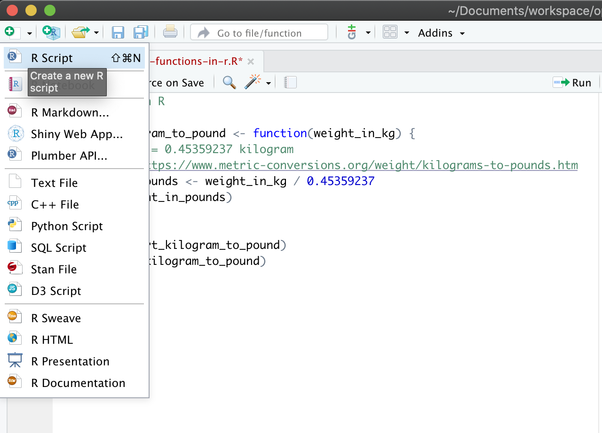
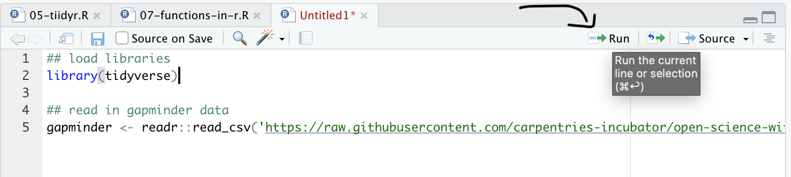
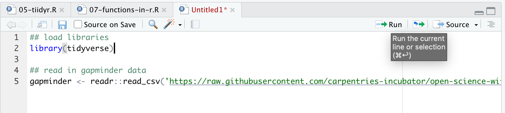

# Table of contents

<!-- MarkdownTOC autolink="true" levels="1,2,3" -->

- [1. Introduction](#1-introduction)
  - [1.1 Create an R script](#11-create-an-r-script)
  - [1.2 Run this R script](#12-run-this-r-script)
    - [Option 1: run your R script line by line.](#option-1-run-your-r-script-line-by-line)
    - [Option 2: run the entire R script](#option-2-run-the-entire-r-script)
    - [Keyboard shortcuts recap](#keyboard-shortcuts-recap)
- [2 Automation with for loops](#2-automation-with-for-loops)
  - [2.1 One country](#21-one-country)
  - [2.2 Generalizing our code](#22-generalizing-our-code)
  - [2.3 For loop basic structure](#23-for-loop-basic-structure)
  - [2.4 Executable for loop!](#24-executable-for-loop)
- [3. Conditional statements with `if` and `else`](#3-conditional-statements-with-if-and-else)
  - [3.1  `if` statement basic structure](#31-if-statement-basic-structure)
  - [3.2 Executable if statement](#32-executable-if-statement)
  - [3.3 Executable if/else statement](#33-executable-ifelse-statement)
- [4. Resources](#4-resources)

<!-- /MarkdownTOC -->

  
# 1. Introduction

Now we are going to build a little analysis. We will learn to automate our analyses with a *for loop*. We will make figures, and save them each with automated labeling. Then, we will join data from different files and conditionally label them with if/else statements.

OK, here is the plan for our analysis. We want to plot the **gdpPercap** for each country in the gapminder data frame. So that's 142 separate plots! We will automate this, labeling each one with its name and saving it in a folder called figures. We will learn a bunch of things as we go.

## 1.1 Create an R script

OK, now, we are going to create an R script. What is an R script? It's a text file with a `.R` extension. We've been writing R code in R Markdown files with the `.Rmd` file extension so far.   

R scripts are just R code without the Markdown plain text along with it.

Go to _File > New File > R Script_ (or click the green plus in the top left corner).

Let's start off with a few comments so that we know what it is for, and save it:

~~~
## gapminder-analysis.R
## R-based analysis with gapminder data
~~~
{: .language-r}

We'll be working with the gapminder data again so let's read it in here:

~~~
## load libraries
library(tidyverse)

## read in gapminder data
gapminder <- readr::read_csv('https://raw.githubusercontent.com/carpentries-incubator/open-science-with-r/gh-pages/data/gapminder.csv')
~~~
{:.language-r}
 

⚠️ Save this script and call it `programming-with-r.R`. 

## 1.2 Run this R script

Remember, like in R Markdown, hitting return does not execute this command. To execute it, we need to get what we typed in the script down into the console. There are several options there. 

### Option 1: run your R script line by line. 

You can click on "Run" to execute the selected line of your code. 

Alternatively, you can use the keyboard shortcuts `Ctrl+Enter` (Windows) or `Cmd+Return` (Mac OS). 

### Option 2: run the entire R script

If you clean your workspace with the 🧹to remove all R objects in memory. Then run the entire script. This is great for testing purposes as it will show you potential problems with your code. 

To do this, either:
* go to _Code > Run Region > Run All_ (see image below).
* type `source("programming-with-r.R")` in your console. Change the name of the script if you have saved it under a different name. 
* Use the `Ctrl+Alt+R` (Windows) or `Cmd+Alt+R` (Mac OS).

### Keyboard shortcuts recap

| What you want to do           | Windows   | Mac OS  |
|------------------------------ |---------  |-------- |
| Run the current line of code  | `Ctrl + Enter` | `Cmd + Return`  |
| Run the complete script       | `Ctrl+Alt+R`   | `Cmd+Alt+R`     |

 

# 2 Automation with for loops

Our plan is to plot __gdpPercap__ for each country. This means that we want to do the same operation (plotting gdpPercap) on a bunch of different things (countries). Previously, we learned the dplyr's `group_by()` function, and this is super powerful to automate through groups. But there are things that you may not want to do with `group_by()`, like plotting. So we will use a *for loop*.

## 2.1 One country
Let's start off with what this would look like for just one country. I'm going to demonstrate with Afghanistan 🇦🇫:

~~~
## filter the country to plot
gap_to_plot <- gapminder %>%
  filter(country == "Afghanistan")

## plot
my_plot <- ggplot(data = gap_to_plot, aes(x = year, y = gdpPercap)) +
  geom_point() +
  labs(title = "Afghanistan")
~~~
{:.language-r}

Let's actually give this a better title than just the country name. Let's use the `base::paste()` function from to paste two strings together so that the title is more descriptive. Use `?paste` to see what the "sep" variable does.
~~~
## filter the country to plot
gap_to_plot <- gapminder %>%
  filter(country == "Afghanistan")

## plot
my_plot <- ggplot(data = gap_to_plot, aes(x = year, y = gdpPercap)) +
  geom_point() +
  ## add title and save
  labs(title = paste("Afghanistan", "GDP per capita", sep = " "))
~~~
{:.language-r}

And as a last step, let's save this figure.

~~~
## filter the country to plot
gap_to_plot <- gapminder %>%
  filter(country == "Afghanistan")

## plot
my_plot <- ggplot(data = gap_to_plot, aes(x = year, y = gdpPercap)) +
  geom_point() +
  ## add title and save
  labs(title = paste("Afghanistan", "GDP per capita", sep = " "))

ggsave(filename = "Afghanistan_gdpPercap.png", plot = my_plot)
~~~
{:.language-r}

OK. So we can check our repo in the file pane (bottom right of RStudio) and see the generated figure:

## 2.2 Generalizing our code

Now, in our code above, we've had to write out "Afghanistan" several times. This makes it not only typo-prone as we type it each time, but if we wanted to plot another country, we'd have to write that in 3 places too. It is not setting us up for an easy time in our future, and thinking ahead in programming is something to keep in mind.

Instead of having "Afghanistan" written 3 times, let's instead create an object that we will assign to "Afghanistan". This object will be named `cntry` and will help to generalize our script to other countries as well. 

> ## Note
> Since `country` is one variable name in the `gapminder` dataframe, we name our generalisation variable `cntry` to avoid ambiguity when refering to a variable. 
{: .callout}

~~~
## create country variable
cntry <- "Afghanistan"
~~~
{:.language-r}

Now, we can replace each `"Afghanistan"` with our variable `cntry`. We will have to introduce a `paste` statement here too, and we want to separate by nothing (`""`). Note: there are many ways to create the filename, and we are doing it this way for a specific reason right now.

~~~
## create country variable
cntry <- "Afghanistan"

## filter the country to plot
gap_to_plot <- gapminder %>%
  filter(country == cntry)

## plot
my_plot <- ggplot(data = gap_to_plot, aes(x = year, y = gdpPercap)) +
  geom_point() +
  ## add title and save
  labs(title = paste(cntry, "GDP per capita", sep = " "))

## note: the file name is created on the fly here using paste() 
ggsave(filename = paste(cntry, "_gdpPercap.png", sep = ""), 
       plot = my_plot)
~~~
{:.language-r}

Let's run this. Great! it saved our figure (I can tell this because the timestamp in the Files pane has updated!)

> ## Exercise
> Change one line of code and plot the GDP per capita of Cuba. 
> 
> > ## Solution
> > The only line to be changed is `cntry <- "Cuba"` as this will overwrite the value of `cntry`.
> {: .solution}
{: .challenge}

## 2.3 For loop basic structure

Now, how about if we want to plot not only Afghanistan, but other countries as well? There wasn't actually that much code needed to get us here, but we definitely do not want to copy this for every country. Even if we copy-pasted and switched out the country assigned to the `cntry` variable, it would be very typo-prone. Plus, what if you wanted to instead plot `lifeExp`? You'd have to remember to change it each time...it gets messy quickly.

Better with a *for loop*. This will let us cycle through and do what we want to each thing in turn. If you want to iterate over a set of values, and perform the same operation on each, a `for` loop will do the job.

**Sit back and watch me for a few minutes while we develop the for loop.** Then we'll give you time to do this on your computers as well.

The basic structure of a `for` loop is:
~~~
for ( each item in set of items ) {
  do a thing
}
~~~
{:.language-r}
Note the `( )` and the `{ }`. We talk about iterating through each item in the *for loop*, which makes each item an iterator.

So looking back at our Afghanistan code: all of this is pretty much the "do a thing" part. And we can see that there are only a few places that are specific to Afghanistan. If we could make those places not specific to Afghanistan, we would be set.

Let's paste from what we had before, and modify it. I'm also going to use RStudio's indentation help to indent the lines within the for loop by highlighting the code in this chunk and going to Code > Reindent Lines (shortcut: command I)
~~~
## create country variable
cntry <- "Afghanistan"

for (each country in a list of countries ) {

  ## filter the country to plot
  gap_to_plot <- gapminder %>%
    filter(country == cntry)

  ## plot
  my_plot <-
    ggplot(data = gap_to_plot, aes(x = year, y = gdpPercap)) +
      geom_point() +
      labs(title = paste(cntry, "GDP per capita", sep = " "))
  # save your plot on disk
  ggsave(filename = paste(cntry, "_gdpPercap.png", sep = ""), plot = my_plot)

}
~~~
{:.language-r}

## 2.4 Executable for loop!

OK. So let's start with the beginning of the *for loop*. We want a list of countries that we will iterate through. We can do that by adding this code before the *for loop*.

~~~
## create a list of countries
country_list <- c("Albania", "Canada", "Spain")

for ( cntry in country_list ) {

  ## filter the country to plot
  gap_to_plot <- gapminder %>%
    filter(country == cntry)

  ## plot
  my_plot <- ggplot(data = gap_to_plot, aes(x = year, y = gdpPercap)) +
    geom_point() +
    labs(title = paste(cntry, "GDP per capita", sep = " "))
  ## save your plot
  ggsave(filename = paste(cntry, "_gdpPercap.png", sep = ""), plot = my_plot)
}
~~~
{:.language-r}

At this point, we do have a functioning *for loop*. For each item in the `country_list`, the *for loop* will iterate over the code within the `{ }`, changing `country` each time as it goes through the list. And we can see it works because we can see them appear in the files pane at the bottom right of RStudio!

Great! And it doesn't matter if we just use these three countries or all the countries--let's try it.

But first let's create a figure directory and make sure it saves there since it's going to get out of hand quickly. We could do this from the Finder/Windows Explorer, or from the "Files" pane in RStudio by clicking "New Folder" (green plus button). But we are going to do it in R. A folder is called a directory:

~~~
dir.create("figures")

## create a list of countries
country_list <- unique(gapminder$country) # ?unique() returns the unique values

for( cntry in country_list ){

  ## filter the country to plot
  gap_to_plot <- gapminder %>%
    filter(country == cntry)

  ## plot
  my_plot <- ggplot(data = gap_to_plot, aes(x = year, y = gdpPercap)) +
    geom_point() +
    ## add title and save
    labs(title = paste(cntry, "GDP per capita", sep = " "))

  ## add the figures/ folder
  ggsave(filename = paste("figures/", cntry, "_gdpPercap.png", sep = ""), plot = my_plot)
}
~~~
{:.language-r}
*For loops* are sometimes just the thing you need to iterate over many things in your analyses.

> ## Exercise
> 1. Create the `gapminder_europe` dataframe that contains only values for European countries. 
> 2. Calculate the cumulative sum of the `gdpPercap` along the years using the `cumsum()` function of base R. 
> Create a new column called `gdp_cumulative_sum`.  
> 3. Loop through countries in Europe and plot the cumulative sum of the `gdpPercap` per year for every country.  
> 4. Save your figures to a new subfolder called "Europe/".
>
> > ## Solution
> > ~~~
> > gap_europe <- gapminder %>%
> >   filter(continent == "Europe") %>% 
> >   mutate(gdpPercap_cumulative_sum = cumsum(gdpPercap))
> > 
> > dir.create("Europe/")
> > 
> > country_list <- unique(gap_europe$country)
> > 
> > for (cntry in country_list) {
> >   ## filter the country to plot
> >   gap_to_plot <- 
> >     gap_europe  %>%
> >     filter(country == cntry)
> >   
> >   my_plot <-
> >     ggplot(data = gap_to_plot, aes(x = year, y = gdpPercap_cumulative_sum)) +
> >     geom_point() +
> >     labs(title = paste(cntry, "GDP per capita", sep = " ")) +
> >   
> >   # Save plot 
> >   ggsave(filename = paste("Europe/", cntry, "-gdpPercap.png", sep = ""), plot = my_plot)
> > }
> > ~~~  
> > {: .language-r}
> {: .solution}
{: .challenge}

Notice how we put the calculation for `cummean()` outside the *for loop*. It could have gone inside, but it's an operation that could be done just one time before hand (outside the loop) rather than multiple times as you go (inside the *for loop*).

 

# 3. Conditional statements with `if` and `else`

Often when we're coding we want to control the flow of our actions. This can be done by setting actions to occur only if a condition or a set of conditions are met.

In R and other languages, these are called **if statements**.

## 3.1  `if` statement basic structure

~~~
# if
if (condition is true) {
  do something
}

# if ... else
if (condition is true) {
  do something
} else {  # that is, if the condition is false,
  do something different
}
~~~
{:.language-r}

Let's bring this concept into our *for loop* for Europe that we've just done. What if we want to add the label "Estimated" to countries that were estimated? Here's what we'd do.

First, import `.csv` file with information on whether data was estimated or reported, and perform a `left_join` to gapminder dataset:

~~~
est <- readr::read_csv('https://raw.githubusercontent.com/carpentries-incubator/open-science-with-r/gh-pages/data/countries_estimated.csv')
gapminder_est <- left_join(gapminder, est)
~~~
{:.language-r}

This adds a column called "estimated" to the dataframe with "yes/no" values. We will use this column in the if statement.  

~~~
# A tibble: 1,704 x 7
   country      year      pop continent lifeExp gdpPercap estimated
   <chr>       <dbl>    <dbl> <chr>       <dbl>     <dbl> <chr>    
 1 Afghanistan  1952  8425333 Asia         28.8      779. yes      
 2 Afghanistan  1957  9240934 Asia         30.3      821. yes      
 3 Afghanistan  1962 10267083 Asia         32.0      853. yes      
 4 Afghanistan  1967 11537966 Asia         34.0      836. yes      
 5 Afghanistan  1972 13079460 Asia         36.1      740. yes      
 6 Afghanistan  1977 14880372 Asia         38.4      786. yes      
 7 Afghanistan  1982 12881816 Asia         39.9      978. yes      
 8 Afghanistan  1987 13867957 Asia         40.8      852. yes      
 9 Afghanistan  1992 16317921 Asia         41.7      649. yes      
10 Afghanistan  1997 22227415 Asia         41.8      635. yes   
~~~
{: .output}

~~~
dir.create("figures")
dir.create("figures/Europe")

## create a list of countries
gap_europe <- gapminder_est %>% ## use instead of gapminder
  filter(continent == "Europe") %>%
  mutate(gdpPercap_cumsum = cumsum(gdpPercap))

country_list <- unique(gap_europe$country)

for ( cntry in country_list ) {

  ## filter the country to plot
  gap_to_plot <- gap_europe %>%
    filter(country == cntry)

  ## add a print message
  print(paste("Plotting", cntry))

  ## plot
  my_plot <- ggplot(data = gap_to_plot, aes(x = year, y = gdpPercap_cumsum)) +
    geom_point() +
    ## add title and save
    labs(title = paste(cntry, "GDP per capita", sep = " "))

  ## if estimated, add that as a subtitle.
  if (gap_to_plot$estimated == "yes") {

    ## add a print statement just to check
    print(paste(cntry, "data are estimated"))

    my_plot <- my_plot +
      labs(subtitle="Estimated data")
  }
  #   Warning message:
  # In if (gap_to_plot$estimated == "yes") { :
  #   the condition has length > 1 and only the first element will be used

  ggsave(filename = paste("figures/Europe/", cntry, "_gdpPercap_cumsum.png", sep = ""),
         plot = my_plot)

}
~~~
{:.language-r}

This worked, but we got a warning message with the if statement. This is because if we look at `gap_to_plot$estimated`, it is many "yes"s or "no"s, and the if statement works just on the first one. We know that if any are yes, all are yes, but you can imagine that this could lead to problems down the line if you *didn't* know that. So let's be explicit:

## 3.2 Executable if statement

~~~
dir.create("figures")
dir.create("figures/Europe")

## create a list of countries
gap_europe <- gapminder_est %>% ## use instead of gapminder
  filter(continent == "Europe") %>%
  mutate(gdpPercap_cumsum = cumsum(gdpPercap))

country_list <- unique(gap_europe$country)

for ( country in country_list ) {

  ## filter the country to plot
  gap_to_plot <- gap_europe %>%
    filter(country == country)

  ## add a print message
  print(paste("Plotting", country))

  ## plot
  my_plot <- ggplot(data = gap_to_plot, aes(x = year, y = gdpPercap_cumsum)) +
    geom_point() +
    ## add title and save
    labs(title = paste(country, "GDP per capita", sep = " "))

  ## if estimated, add that as a subtitle.
  if (any(gap_to_plot$estimated == "yes")) { # any() will return a single TRUE or FALSE

    print(paste(country, "data are estimated"))

    my_plot <- my_plot +
      labs(subtitle = "Estimated data")
  }
  ggsave(filename = paste("figures/Europe/", country, "_gdpPercap_cumsum.png", sep = ""),
         plot = my_plot)

}
~~~
{:.language-r}

OK so this is working as we expect! Note that we do not need an `else` statement above, because we only want to do something (add a subtitle) if one condition is met. But what if we want to add a different subtitle based on another condition, say where the data are reported, to be extra explicit about it?

## 3.3 Executable if/else statement

~~~
dir.create("figures")
dir.create("figures/Europe")

## create a list of countries
gap_europe <- gapminder_est %>% ## use instead of gapminder
  filter(continent == "Europe") %>%
  mutate(gdpPercap_cummean = cumsum(gdpPercap))

country_list <- unique(gap_europe$country)

for ( cntry in country_list ) {

  ## filter the country to plot
  gap_to_plot <- gap_europe %>%
    filter(country == cntry)

  ## add a print message
  print(paste("Plotting", cntry))

  ## plot
  my_plot <- ggplot(data = gap_to_plot, aes(x = year, y = gdpPercap_cumsum)) +
    geom_point() +
    ## add title and save
    labs(title = paste(cntry, "GDP per capita", sep = " "))

  ## if estimated, add that as a subtitle.
  if (any(gap_to_plot$estimated == "yes")) { # any() will return a single TRUE or FALSE

    print(paste(cntry, "data are estimated"))

    my_plot <- my_plot +
      labs(subtitle = "Estimated data")
  }
  ggsave(filename = paste("figures/Europe/", cntry, "_gdpPercap_cumsum.png", sep = ""),
         plot = my_plot)

}
~~~
{:.language-r}

Note that this works because we know there are only two conditions, `Estimated == yes` and `Estimated == no`. In the first `if` statement we asked for estimated data, and the `else` condition gives us everything else (which we know is reported). We can be explicit about setting these conditions in the `else` clause by instead using an `else if` statement. Below is how you would construct this in your *for loop*, similar to above:

~~~
   if (any(gap_to_plot$estimated == "yes")) { # any() will return a single TRUE or FALSE

    print(paste(cntry, "data are estimated"))

    my_plot <- my_plot +
      labs(subtitle = "Estimated data")
  } else if (any(gap_to_plot$estimated == "no")){

    my_plot <- my_plot +
      labs(subtitle = "Reported data")

    print(paste(cntry, "data are reported"))

  }
~~~
{:.language-r}

This construction is necessary if you have more than two conditions to test for.

# 4. Resources

- [stringr](http://r4ds.had.co.nz/strings.html)
- Hadley Wichkam scripting tips: [R for Data Science](https://r4ds.had.co.nz/workflow-scripts.html)
