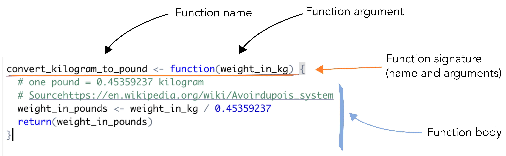

<!-- MarkdownTOC autolink="True" levels="1,2" -->

- [1. Introduction](#1-introduction)
	- [1.1 When to make functions?](#11-when-to-make-functions)
	- [1.2 Function components](#12-function-components)
	- [1.3 A simple example](#13-a-simple-example)
	- [1.4 Function environment](#14-function-environment)
	- [1.5 Recap scheme](#15-recap-scheme)
	- [1.6 Setup](#16-setup)
- [2. Steps when building a function](#2-steps-when-building-a-function)
	- [2.1 Find a name](#21-find-a-name)
	- [2.2 Turn your initial script into the body of a function](#22-turn-your-initial-script-into-the-body-of-a-function)
	- [2.3 Add arguments in the function signature](#23-add-arguments-in-the-function-signature)
- [3. Functional programming in R](#3-functional-programming-in-r)
	- [3.1 The `map()` function](#31-the-map-function)
	- [3.2 Application to `gapminder`](#32-application-to-gapminder)
	- [3.3 For loops versus vectorised operations](#33-for-loops-versus-vectorised-operations)
- [4. References](#4-references)

<!-- /MarkdownTOC -->

#  1. Introduction
Functions are at the heart of the R programming language. A lot of analytical steps you will perform in R will be based composed of a series of functions working together.

## 1.1 When to make functions?
- When you repeat yourself many times. Same block of code repeated over and over (copy-paste-mistake pattern).
- When your code becomes very long (e.g. > 50 lines) and it becomes hard to understand the logic behind your code. What are the steps taken?
- When you want to reuse  code over multiple projects over time. Think about a function that makes a plot from the same type of input data, a functiont that performs unit conversion, etc.
-  Why? - When you need to create a series of plots, models that all differ by very few optional arguments (e.g. p-value threhold), etc. 

## 1.2 Function components    

- __Signature:__ the name of the function together with its arguments. 
- __Arguments:__ arguments of your function. This can be accessed using the `?formals(my_function)` or `?args(my_function)`
- __Body:__ function definition (inside curly braces). What your function does. 
- __Environment:__ the variables and objects in R memory that are known to R inside the function.  

## 1.3 A simple example
Here is a simple function that converts the _weight in kilograms_ to its corresponding _weight in pounds_. The conversion rate is taken from [Wikipedia](https://en.wikipedia.org/wiki/Avoirdupois_system).   

~~~
convert_kilogram_to_pound <- function(weight_in_kg) {
  # one pound = 0.45359237 kilogram
  # Sourcehttps://en.wikipedia.org/wiki/Avoirdupois_system
  weight_in_pounds <- weight_in_kg / 0.45359237
  return(weight_in_pounds)
}
~~~
{: .language-r}

 
> ## Exercise
> Question 1: Apply the `formals()` function to the `convert_kilogram_to_pound` function. What component of the function do you find?  
> Question 2: What does the `body()` function call on `convert_kilogram_to_pound` return? 
> 
> > ## Solution
> > `formals(convert_kilogram_to_pound)` returns the name(s) of the function arguments. Here it returns `weight_in_kg` as it is the only argument. An alternative function is `formalArgs(convert_kilogram_to_pound)`  which only returns the name of the argument as a character.   
> > `body(convert_kilogram_to_pound)` returns the code written inside the `convert_kilogram_to_pound()` function. 
>{: .solution}
{: .challenge}

## 1.4 Function environment

FIXME 

## 1.5 Recap scheme

## 1.6 Setup

Before we dive further into functions, let's get ready:   
1. First of all, let's clear our current workspace with the 🧹  
2. Then, let's reload the `tidyverse` suite of packages. 
3. We will also need another package called `rlang`.
4. Finally, let's re-import the gapminder dataset to make sure we work with non-modified data. 

~~~
rm(list = ls()) # similar to the broom. Removes all objects from the current workspace
library("tidyverse")
library("rlang")
gapminder <- readr::read_csv('https://raw.githubusercontent.com/carpentries-incubator/open-science-with-r/gh-pages/data/gapminder.csv')
~~~
{: .language-r}

  

# 2. Steps when building a function

## 2.1 Find a name 

Remember the names of `dplyr` functions?
* `filter` acts on a dataframe rows and _filters_ based on a logic test (`> 0`)
* `select` acts on a dataframe columns and _selects_ columns based on their names for instance. 

These are good names because they are __verbs__ and because they are explicit on what they do. 

> ## What's in a name?
> "A rose by any other name would smell as sweet" (Romeo and Juliette, Shakespeare).  
> Sure! But for functions, naming is essential 😊 
{: .testimonial}

So make sure you give your custom function, a clear distinctive name. 

> ## Exercise
> `lm()` is an example of a badly named function.   
> 1. Find what `lm()` stands for by typing `?lm()`  
> 2. Can you suggest a better name for that function?
>
> > ## Solution
> > 1. `lm()` stands for linear model. It fits a linear model on some dataset.   
> > 2. A better name could be "fit_linear_model()" for instance. It has a verb and is not an abbreviation. 
> {: .solution}
{: .challenge}

## 2.2 Turn your initial script into the body of a function

Let's see how we can convert our script to plot the GDP per capita per country [section 2.1 of the previous episode](/06-R-programming/index.html#21-one-country)

This is what we had. 

~~~
## filter the country to plot
gap_to_plot <- gapminder %>%
  filter(country == cntry)

## plot
my_plot <- ggplot(data = gap_to_plot, aes(x = year, y = gdpPercap)) +
  geom_point() +
  ## add title and save
  labs(title = paste(cntry, "GDP per capita", sep = " "))
 ~~~
 {: .language-r}

This will become the body of a new function. 

> ## How shall we call our new function?
> Could you propose a good name for that function? Remember, it has to contain a verb, be relatively short and meaningful.
{: .discussion}

By convention, everything within the body of a function has to be indented. You can add two spaces (space bar x 2) in front of every line. 
Since it is also a good style tip to have indentations after the `%>%` operator ([following the tidyverse style](https://style.tidyverse.org/pipes.html)), you will have a total of 2x2 (4) spaces before some lines. 

~~~
plot_gdp_percap_from_gapminder <- function(data = gapminder){
 
  gap_to_plot <- data %>%
    filter(country == cntry)

  ## plot
  my_plot <- ggplot(data = gap_to_plot, aes(x = year, y = gdpPercap)) +
    geom_point() +
    ## add title and save
    labs(title = paste(cntry, "GDP per capita", sep = " "))

  return(my_plot) # optional but explicit on what the function returns
}
~~~
{: .language-r}

> ## Exercise
> Take a look at the code of our function. There are two lines of code that will not work. Can you find which ones?
> > ## Solution
> > Line 1: `filter(country == cntry)`  
> > Line 2: `labs(title = paste(cntry, "GDP per capita", sep = " "))`  
> These two lines will not work because the `cntry` object is not defined within the function nor outside of the function (in the global environment.)
> {: .solution}
{: .challenge}

## 2.3 Add arguments in the function signature 

Since our function has a body but is missing an argument namely `cntry`, let's add it. We will change its name to `country_to_plot` to better reflect its purpose. 

~~~
# define the function
plot_gdp_percap_from_gapminder <- function(data = gapminder, country_to_plot = "Albania"){
 
  gap_to_plot <- data %>%
    filter(country == country_to_plot)

  ## plot
  my_plot <- ggplot(data = gap_to_plot, aes(x = year, y = gdpPercap)) +
    geom_point() +
    ## add title and save
    labs(title = paste(country_to_plot, "GDP per capita", sep = " "))

  return(my_plot) # optional but explicit on what the function returns
}
# run the function
plot_gdp_percap_from_gapminder <- function(data = gapminder, country_to_plot = "Albania")
~~~
{: .language-r}

If you would execute this code, it would not work because all `tidyverse` functions are using something called "tidy evaluation" that is a form of non-standard evaluation used mostly by `dplyr` verbs such as `filter`, `select` etc.  

> ## tidy evaluation
> This is clearly outside of the scope of this lesson. If interested, please consult the [related `dplyr` section](https://dplyr.tidyverse.org/articles/programming.html) and this [blog post](https://jessecambon.github.io/2019/12/08/practical-tidy-evaluation.html). 
{: .callout}

Inside the function, the `country_to_plot` expression needs to be first _quoted_ (not evaluated) before being passed to `dplyr` functions. We do this by using the `enquo()` function to capture both expression and its initial environment. 

~~~
plot_gdp_percap_from_gapminder <- function(data = gapminder, country_to_plot = "Albania"){
  
  # enquo quotes the "country_to_plot" variable and does not evaluate it yet
  country_to_plot = enquo(country_to_plot) # quote
  
  # uncomment if you want to see what enquo(country_to_plot) does inside the function
  # print(country_to_plot)
  
  gap_to_plot <- data %>%
    filter(country == !!country_to_plot) # unquote
  # the bang bang operator !! evaluates the expression in the dplyr filter call
  
  ## plot
  my_plot <- ggplot(data = gap_to_plot, aes(x = year, y = gdpPercap)) +
    geom_point() +
    ## add title and save
    labs(title = paste(as_name(country_to_plot), "GDP per capita"))
  
  return(my_plot) # optional but explicit on what the function returns
}

# execute the function with default arguments
plot_gdp_percap_from_gapminder()
~~~
{: .language-r}

You should obtain a plot for Albania (default). 

Now, you can easily plot the GDP per capita for a given country. 
~~~
plot_gdp_percap_from_gapminder(country_to_plot = "Cuba")
plot_gdp_percap_from_gapminder(country_to_plot = "France")
~~~

# 3. Functional programming in R

## 3.1 The `map()` function

## 3.2 Application to `gapminder` 

## 3.3 For loops versus vectorised operations

# 4. References 

- [Beautiful custom functions in R](https://www.pluralsight.com/guides/beauty-custom-functions-r)
- [Richie Cotton DataCamp Introduction to Writing Functions in R](https://learn.datacamp.com/courses/introduction-to-function-writing-in-r)
- [Tidy evaluation](https://tidyeval.tidyverse.org/dplyr.html)
- [Exploring Non-Standard Evaluation](https://www.daeconomist.com/post/2018-03-27-exploring-nse-enquo-and-quos/)
- [Programming with dplyr](https://dplyr.tidyverse.org/articles/programming.html#transforming-user-supplied-variables-1)
- [Practical tidy evaluation](https://jessecambon.github.io/2019/12/08/practical-tidy-evaluation.html)