# Table of contents

<!-- MarkdownTOC autolink="True" levels="1,2,3" -->

- [1. Introduction](#1-introduction)
    - [1.1 What is a version control system and why scientists should use it?](#11-what-is-a-version-control-system-and-why-scientists-should-use-it)
    - [1.2 Five reasons to use a version control system in research](#12-five-reasons-to-use-a-version-control-system-in-research)
    - [1.3 `git` is a popular version control software](#13-git-is-a-popular-version-control-software)
    - [1.4 Collaborating with yourself with `git`](#14-collaborating-with-yourself-with-git)
- [2. Tell the story of your project](#2-tell-the-story-of-your-project)
    - [2.1 Create a new RStudio project](#21-create-a-new-rstudio-project)
    - [2.2 Create a new R Markdown document](#22-create-a-new-r-markdown-document)
    - [2.3 Initialize `git` from within the folder](#23-initialize-git-from-within-the-folder)
    - [2.4 Track file changes with `git`](#24-track-file-changes-with-git)
    - [2.5 Making changes and visualising them.](#25-making-changes-and-visualising-them)
    - [2.6 Great commits tell a great story](#26-great-commits-tell-a-great-story)
- [3. Travel back in time](#3-travel-back-in-time)
    - [3.1 History of commits](#31-history-of-commits)
    - [3.2 Back to the past](#32-back-to-the-past)
    - [3.3 Back to the present](#33-back-to-the-present)
- [4. Experiment with changes](#4-experiment-with-changes)
    - [4.1 Create a new branch](#41-create-a-new-branch)
    - [4.2 Modify the plot](#42-modify-the-plot)
    - [4.3 Switch back to the master branch](#43-switch-back-to-the-master-branch)
- [5. Recap of git commands](#5-recap-of-git-commands)
- [5. Resources](#5-resources)

<!-- /MarkdownTOC -->

# 1. Introduction

In this episode, you will learn about the `git` version control system and how to use it in your R project from RStudio. 

We will see how to trace edits and modifications made to your R Markdown document. Also, we will demonstrate how you can revert changes if needed or experiment safely with changes on your valuable code. 

## 1.1 What is a version control system and why scientists should use it?

In the context of a research project, a version control system will help you to manage your project history, progress and support active collaboration with your colleagues but also with you (past, present and future self).  

As a concrete example, this is something we might have all experienced in the past when keeping track of file versions:

> ## Version control is an essential tool in data analysis
> Version control will help you to avoid this file nightmare but also fosters other good practices related to code. 
{: .callout}

## 1.2 Five reasons to use a version control system in research

1. __Tell the story:__ The history of your commit messages will describe your project progress.
2. __Travel back in time:__ a version control system makes it easy to compare different time points of your project smoothly. If you want to compare the stage of your project a year ago from now, it only takes one command-line of code. 
3. __Experiment with changes:__ if you want to make changes in a script, you can first make a "snapshot" of the project status before experimenting with changes. As a researcher, this might be a second nature for you! 
4. __Backup your work:__ by being able to linking your local repository (folder) to a distant online host, a version control system backs up your precious work instantly.
5. __Collaborate easily on projects:__ having a web-hosted synchronised version of your project will encourage collaboration with other researchers. Think about a colleague of yours being able to add a script to make a figure for your first PhD publication for instance.  

There are possibly other important reasons why you could use a version control system for your research project. While originally created for software development, a common usage in scientific research is to track versions of datasets, scripts or figures easily and efficiently.

## 1.3 `git` is a popular version control software

One of the most used version control software out there is `git`. It is a cross-platform tool that is available on Mac and Linux OS natively and that needs to be installed on Windows [check the Setup section on how to do this](/setup.html). `git` is a _version control system_ primarily used in software development.  

> ## Definition
> Defined simply: 
> `git` is an application that runs on your computer like a web browser or a word processor (Tom Stuart).   
{: .callout}

 

## 1.4 Collaborating with yourself with `git`

Using your recently acquired flashy R skills, you are now ready to apply them to your scientific project You start by creating an R Markdown document, add code and text comments, generate an HTML report, save your R Markdown document, etc. 

But how do you make sure that your changes are properly been saved and tracked? What is your backup strategy? This is where `git` will come in handy. 

# 2. Tell the story of your project

Compare two solutions below, one without `git` and one with:

> ## Discussion
> Can you list the potential and proven drawbacks of keeping track of changes by saving copies of the files?
{: .discussion}

In the follow-up section, we will see how to tell a story about the changes applied to our R Markdown document. This storyline will be composed of the git commit messages. 

Let's see how we can use `git` powerful file versioning _from within_ RStudio.

## 2.1 Create a new RStudio project

Projects in RStudio are a great feature and work very well in combination with `git`.
 
Go to RStudio and click on _File > New Project > New directory_. 

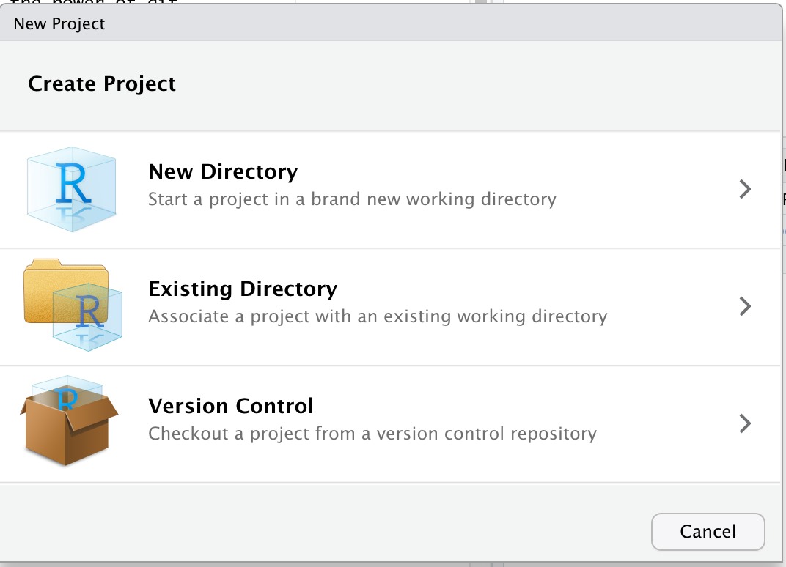

Then select _New project_

We will call our new project "learning_git"

## 2.2 Create a new R Markdown document

Go to _File > New File > R Markdown_ and call it "learning git". Click "OK". It should open this new R Markdown document. 

Below the `## R Markdown`, add a new code chunk, and copy this code: 
~~~
library("tidyverse")
~~~
{: .language-r} 

Save your document under the name `learning_git.Rmd`. You should see this in your _File_ pane: 

## 2.3 Initialize `git` from within the folder

Great, but `git` is still unaware of things that happen in this R project folder. Let's change that. 

In the console pane, click on "Terminal" to get access to a Shell from within RStudio. We will initialise `git` in this folder. 

This is a regular Shell in which you can type any command-line instruction. Let's type this: 

~~~
git init
~~~
{: .language-bash} 

This command created a hidden folder called `.git/` that will contain all information needed by `git` to recapitulate your file changes, project history, etc. 

Try typing this:

~~~
ls -l .git/
~~~
{: .language-bash}

This will show you what happened behing the hood:

~~~
(base) marcs-MacBook-Pro:learning_git mgalland$ ls -l .git/
total 24
-rw-r--r--   1 mgalland  staff   23 Jun 17 17:45 HEAD
-rw-r--r--   1 mgalland  staff  137 Jun 17 17:45 config
-rw-r--r--   1 mgalland  staff   73 Jun 17 17:45 description
drwxr-xr-x  14 mgalland  staff  448 Jun 17 17:45 hooks
drwxr-xr-x   3 mgalland  staff   96 Jun 17 17:45 info
drwxr-xr-x   4 mgalland  staff  128 Jun 17 17:45 objects
drwxr-xr-x   4 mgalland  staff  128 Jun 17 17:45 refs
~~~
{: .language-bash}

## 2.4 Track file changes with `git`

Close and restart RStudio to show the "git" tab in the environment pane. You should see this:

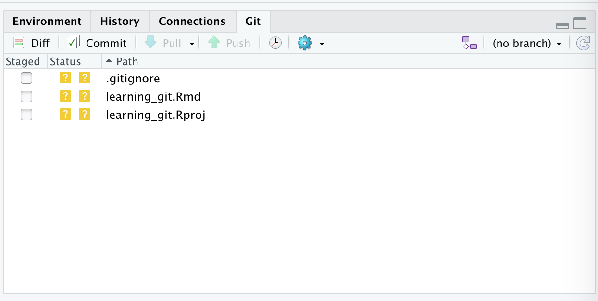

For now, `git` does not track anything in this RStudio project folder. 

We would like `git` to track changes in our `learning_git.Rmd` document. To do this, click in the empty checkbox: 

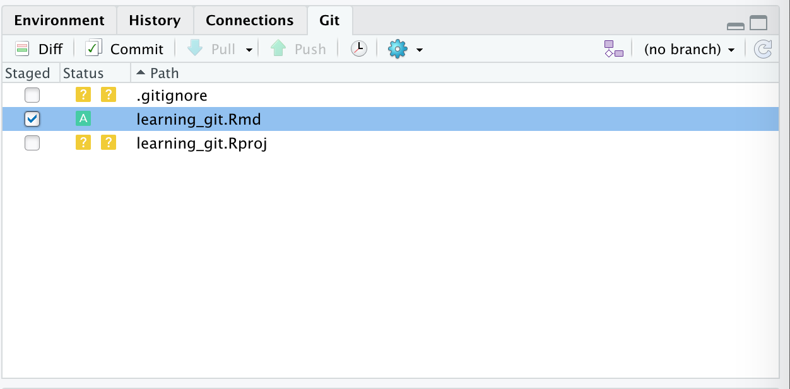

You can see that there is now a small green "A" next to the `learning_git.Rmd` file under the "Status" column. This means that our file is now being tracked by `git`. 

## 2.5 Making changes and visualising them. 

We will first:
1. Import the `gapminder` dataset. 
2. Make a plot of the GDP per capita along the years for Canada. 
3. Write a small comment about the plot. 

These 3 steps will all have their own commit message. Let's start. 

In your Rmd document, create a new code chunk and add this:
~~~
gapminder <- readr::read_csv('https://raw.githubusercontent.com/carpentries-incubator/open-science-with-r/gh-pages/data/gapminder.csv')
~~~
{: .language-r}

Save your `learning_git.Rmd` document 

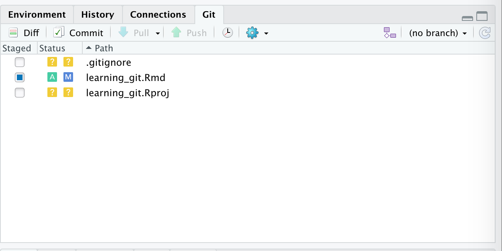

You see a small blue "M" button next to your `learning_git.Rmd` file. This stands for "Modified". You can visualise the changes in your Rmd document by selecting "diff":

This opens a new window where you can see that 3 lines where added (shown in green). These lines are the code chunk we've added where we read the gapminder dataset.

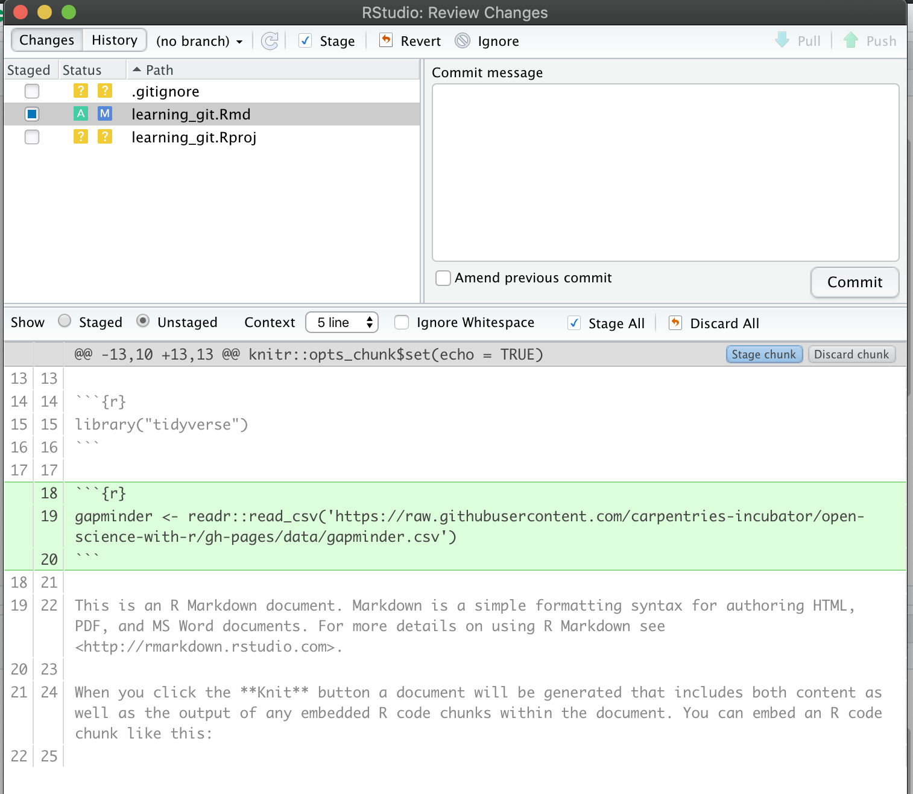

While we are in this "diff" view, we can write a small commit message to describe what happened to our document in a meaningful way. 

In the "Commit message" write this little message: 

~~~
Import the gapminder dataset 

The gapminder dataset is imported using an online url. 
It will be used to produce a plot of the GDP per year.
~~~
{: .language-bash}

Now, click on commit. This will assign a unique identifier to your commit as `git` takes a snapshot of your `learning_git.Rmd` file.

Let's continue our work, add the changes and create commit messages.  

> ## Exercise
> * Step 1: Add a scatterplot of the GDP per capita per year for Canada (use `geom_point`).  Save your Rmd document.    
> * Step 2: Add the modifications by cliking the checkbox under "Staged" to see the blue "M" sign in RStudio git pane.    
> * Step 3: Click on "Diff" to open the new window where you should write a small commit message. Click on "Commit" when you're done.  
> * Step 4: Write a small conclusion about the plot in your Rmd document.    
> * Step 5: save, add/stage changes, commit your changes with a small message. 
{: .challenge}

If all went well, you can click on "History" to preview the history of commits that you have already made:   

This gives you a history of your Rmd file and your project so far. These 3 commits are nicely placed on top of each other. Each of them has a unique SHA identifier to trace it back. We will see in the next section how to move back and forth in time using these SHA ids. 

## 2.6 Great commits tell a great story

> ## A good commit message 
> 1. Separate subject from body with a blank line
> 2. Limit the subject line to 50 characters.
> 3. Capitalize the subject line.
> 4. Do not end the subject line with a period.
> 5. Use the imperative mood in the subject line.
> 6. Wrap the body at 72 characters.
> 7. Use the body to explain what and why vs. how. The how is self-explainable from your code. 
{: .callout}

Here is an example of a good commit message: 

~~~
Fix issue with dplyr filter function

By specifying the dplyr::filter() explicitely
avoid issues with other filter() functions
from other packages
~~~
{: .language-bash}

  

# 3. Travel back in time

## 3.1 History of commits

If all went well in the [previous exercise](/08-git/index.html#25-making-changes-and-visualising-them), you have 3 nicely self-explainable commits like this:  

In this section we will see how to move back and forth between these commits safely. This can be useful to see what happened to a file or to _revert_ to a previous commit (because you are not happy with the current version). 

## 3.2 Back to the past

Imagine that you are not happy with your conclusion about the GDP per capita plot for Canada. Then, it would be useful to _revert_ to a previous commit. In the history, we would like to revert to the previous commit with the message "Add GDP per capita plot". 

Go to the Terminal in the Console pane of RStudio and type:

~~~
git hist
~~~
{: .language-bash}

This will output the commit history of your local folder where you are working. 

~~~
* 21830a4 2021-06-18 | Add a small comment on the GDP plot (HEAD -> master) [Marc Galland]
* 081d7cd 2021-06-18 | Add GDP per capita plot [Marc Galland]
* a5cc728 2021-06-18 | Import the gapminder dataset [Marc Galland]
~~~
{: .output}

The commit id `21830a4` is the most recent one (also called the `HEAD`). The commit we would like to revert to has the commit identifier `081d7cd`. 

> ## Important note
> Your exact commit identifier **should** be different. Using `git hist` identify your commit identifier that is required. Make sure you use your own commit identifier otherwise it will not work.
{: .callout} 

  

In `git`, the command to do this is called `git checkout`. In your terminal in RStudio, type:

~~~
git checkout 081d7cd
~~~
{: .language-bash}

We get a lot of text messages. 

~~~
Note: switching to '081d7cd'.

You are in 'detached HEAD' state. You can look around, make experimental
changes and commit them, and you can discard any commits you make in this
state without impacting any branches by switching back to a branch.

If you want to create a new branch to retain commits you create, you may
do so (now or later) by using -c with the switch command. Example:

  git switch -c <new-branch-name>

Or undo this operation with:

  git switch -

Turn off this advice by setting config variable advice.detachedHead to false

HEAD is now at 081d7cd Add GDP per capita plot

~~~
{: .output}

This simply tells us that our latest commit (the `HEAD`) is now pointing at the commit id `081d7cd` where we added the GDP plot. Again you will have a different commit identifier and that's totally normal. 

Check your `learning_git.Rmd` file. It should have changed and the conclusion about the plot is now gone. 

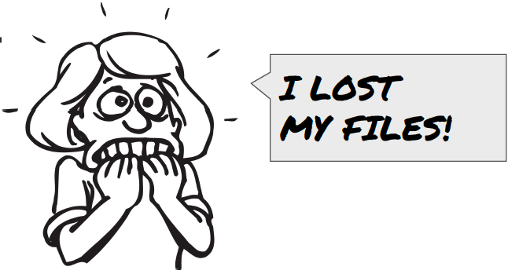

Actually not, `git` has just masked commits that were happening after the commit we checked out. 

> ## Question
> Can you think about another way to delete the plot conclusion? 
> > ## Solution
> > You can also delete the plot conclusion, save your Rmd document and commit this new change. Commits are as much about deleted code/text as about additions. 
> {: .solution}
{: .challenge}

## 3.3 Back to the present

Ok, let's get back to the latest commit in one step:
~~~
git checkout master
~~~
{: .language-bash}

Now we retrieve our most up to date Rmd document.  

# 4. Experiment with changes 

One of the greatest feature of `git` is that it allows you to experiment with changes without any harm to your functional R script. Imagine that you want to change the way you perform statistics and see the consequences. This is easy with `git`. 

## 4.1 Create a new branch

FIXME: create a branch called "barplot" where you modify the Canada GDP scatterplot into a bar plot. 

## 4.2 Modify the plot

Modify your code that you previously wrote to make a [bar plot](https://en.wikipedia.org/wiki/Bar_chart) instead of a scatterplot. Here is a suggestion: 
~~~
gapminder %>% 
  filter(country == "Canada") %>% 
  ggplot(., aes(x = year, y = gdpPercap)) +
    geom_histogram(stat = "identity")

~~~
{: .language-r}

Make sure you add + commit your changes. 

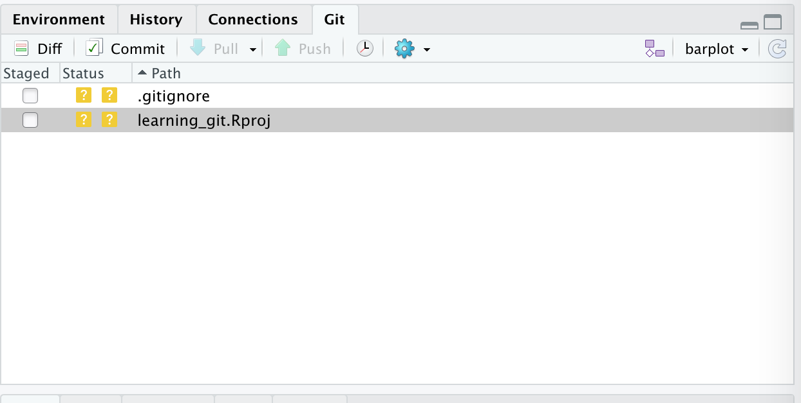

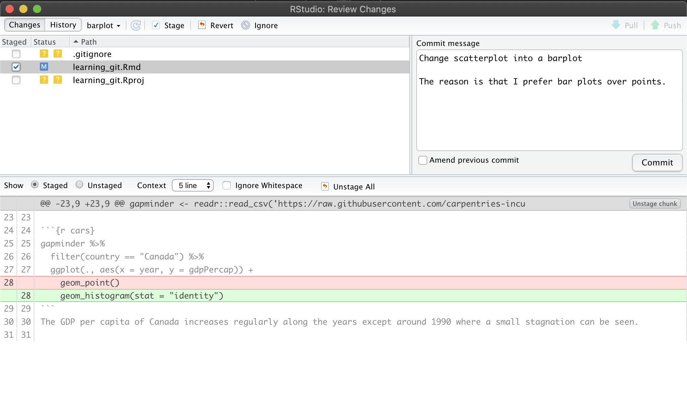

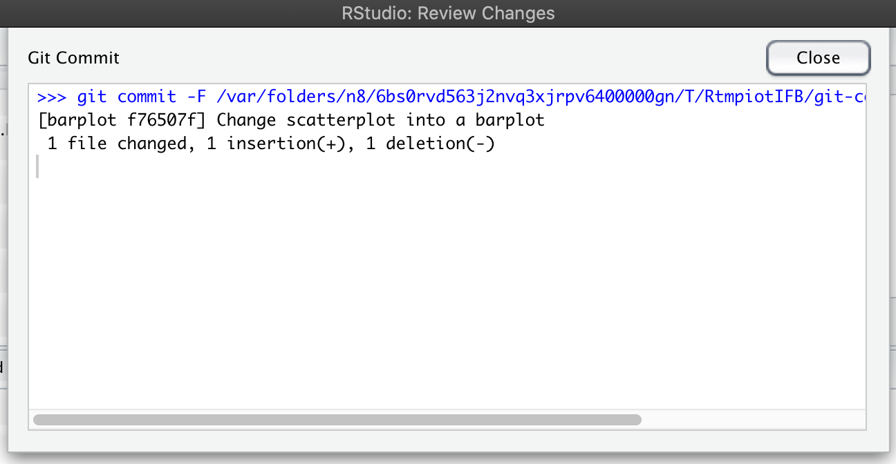

## 4.3 Switch back to the master branch

Once your changes are committed inside the `barplot` branch, you can easily switch back to the main branch called the `master` branch. 
You can either use the branch tool in RStudio and select `master` or use the Terminal of RStudio (see below):

**RStudio tool**
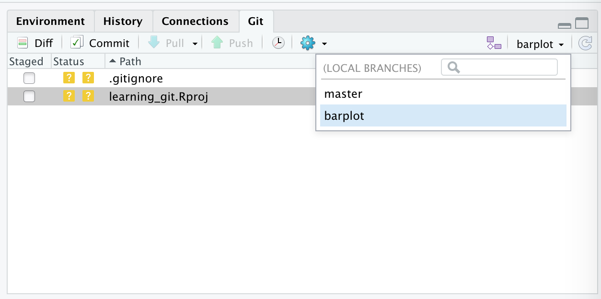

**Terminal alternative**
~~~
git checkout master
~~~
{: .language-bash}

This will switch your Rmd document to its original content on the `master` branch. The plot is now a scatterplot. 

> ## Branch are key to `git` power
> Branches are a great feature since they allow you to experiment changes, test options without altering your main functional piece of work. 
{: .callout}

 

# 5. Recap of git commands

Before we dive in, there is a bit of technical terms to know. 

| git command      | description                                                                           | RStudio equivalent                                                                |
|------------------|-------------------------------------------------------------------------------------  |------------------------------------------------------------------------------     |
| `git add`        | asking git to track the file changes. This is also called "staging" the file.         |              |
| `git commit`     | taking a snapshot of the folder at a given time point.                                | 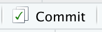         | 
| `git status`     | asking git to give an overview of changes to be committed, untracked   files, etc.    | None                                                                              | 
| `git hist`       | list the history of commits                                                           |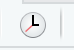 |
| `git log`        | showing the most recent commits. Do `git log --oneline` for more concision            | |
| `git checkout -b`| makes a new branch                                                                    |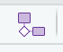 |

  

# 5. Resources

- [A "git for humans" presentation](https://inbo.github.io/git-course/static/presentations/git.pdf)
- Jenny Bryan's [HappyGitWithR](http://happygitwithr.com) is very useful for troubleshooting, particularly the sections on [Detect Git from RStudio](http://happygitwithr.com/rstudio-see-git.html) and [RStudio, Git, GitHub Hell (troubleshooting)](http://happygitwithr.com/troubleshooting.html).
- [Online game](https://learngitbranching.js.org/)
- [RStudio webinar on GitHub and RStudio](https://rstudio.com/resources/webinars/managing-part-2-github-and-rstudio/)
- [Using git and GitHub for scientific writing](http://paulklemm.com/blog/2014-07-16-use-github-for-scientific-writing/)