# Table of contents

<!-- MarkdownTOC autolink="True" levels="1,2,3" -->

- [1. Introduction](#1-introduction)
    - [1.1 What is GitHub?](#11-what-is-github)
    - [1.2 GitHub jargon](#12-github-jargon)
    - [1.3 GitHub fosters collaboration between you and yourself](#13-github-fosters-collaboration-between-you-and-yourself)
    - [1.4 GitHub supports collaboration with others](#14-github-supports-collaboration-with-others)
- [2. Me, myself and GitHub](#2-me-myself-and-github)
    - [2.1 Setup](#21-setup)
    - [2.2 Create a repository on GitHub](#22-create-a-repository-on-github)
    - [2.3 Create an RStudio project and clone this repository](#23-create-an-rstudio-project-and-clone-this-repository)
    - [2.4 Practice](#24-practice)
- [3. Collaborating with others](#3-collaborating-with-others)
    - [3.1 Pair up and work collaboratively](#31-pair-up-and-work-collaboratively)
    - [3.2 Owner \(Partner 1\) setup](#32-owner-partner-1-setup)
        - [3.2.1 Create a Github repository](#321-create-a-github-repository)
        - [3.2.2 Create a gh-pages branch](#322-create-a-gh-pages-branch)
    - [3.3 Give your collaborator administration privileges \(Partner 1 and 2\)](#33-give-your-collaborator-administration-privileges-partner-1-and-2)
    - [3.4 Clone to a new Rproject \(Owner Partner 1\)](#34-clone-to-a-new-rproject-owner-partner-1)
    - [3.5 Collaborator \(Partner 2\) part](#35-collaborator-partner-2-part)
        - [3.5.1 Clone to a new Rproject  \(Partner 2\)](#351-clone-to-a-new-rproject-partner-2)
        - [3.5.2 Edit a file and sync \(Partner 2\)](#352-edit-a-file-and-sync-partner-2)
    - [3.6 State of the Repository](#36-state-of-the-repository)
- [4. Merge conflicts](#4-merge-conflicts)
    - [4.1 Demo](#41-demo)
    - [4.2 Your turn](#42-your-turn)
    - [4.3 Avoiding merge conflicts](#43-avoiding-merge-conflicts)
    - [4.4 Create your collaborative website](#44-create-your-collaborative-website)
    - [Your turn](#your-turn)
- [5. Explore on GitHub.com](#5-explore-on-githubcom)
    - [5.1 Commit History](#51-commit-history)
    - [5.2 Blame](#52-blame)
    - [5.3 Issues](#53-issues)
    - [5.4 NYC flights exploration](#54-nyc-flights-exploration)
        - [Partner 2 pull](#partner-2-pull)
        - [Logical operators](#logical-operators)
        - [Partner 2 sync](#partner-2-sync)
    - [Your turn](#your-turn-1)
- [6. Resources and credits](#6-resources-and-credits)
    - [6.1 Useful links](#61-useful-links)
    - [6.2 Icons](#62-icons)

<!-- /MarkdownTOC -->

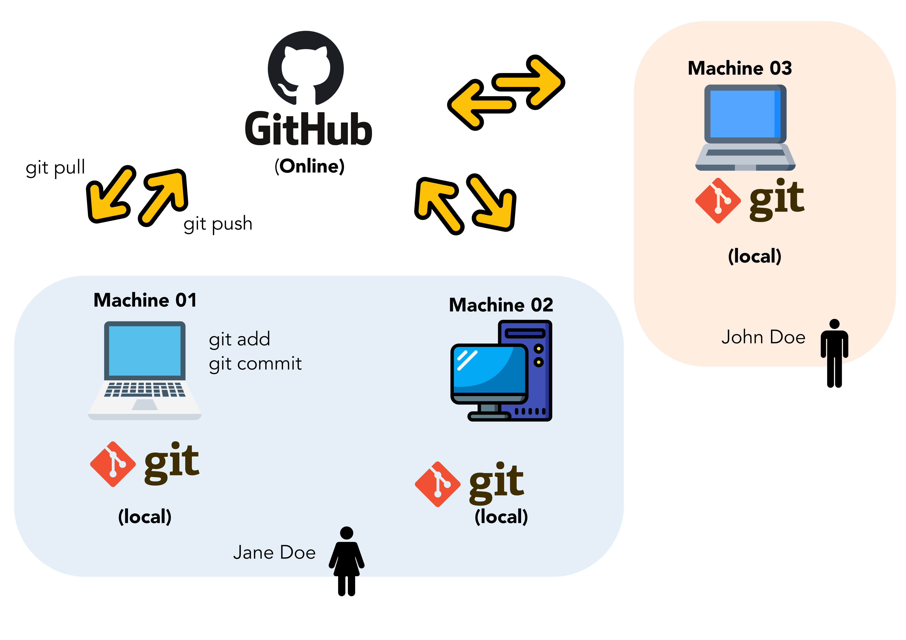

# 1. Introduction

In this episode, we will see different ways to collaborate using `git` and GitHub.

## 1.1 What is GitHub? 

[GitHub](https://en.wikipedia.org/wiki/GitHub) is a company recently acquired by Microsoft in 2018 that serves as a hosting service for code used in software development. It natively supports version control and interplays smoothly with local version control system like `git`. 

Functionalities of GitHub includes:
* __issues:__ report a bug, suggest code improvements, etc. 
* __access control:__ code can be made private or public, collaborators can be allowed access to certain repositories but not others, etc.
* __service integration:__ GitHub allows you to trigger actions on other websites. For instance, when you make a release of your code, it can be automatically archived on [Zenodo](https://zenodo.org/) with a persistent identifier (doi).  
* __contributions:__ visualisation of contributions on code from different authors is easy and can be visualised at a glance.  

## 1.2 GitHub jargon

Here is a small recap of GitHub technical terms you might encounter. Some are common with `git` so you could be familiar with some terms. 

| GitHub jargon                                                                                 | human translation                                                                                                                                         |
|--------------------------------------------------------------------------------------------   |---------------------------------------------------------------------------------------------------------------------------------------------------------  |
| __user__                                             | a Github account for you (e.g., jules32).                                                                                                                 |
| **organization**                | the Github account for one or more user (e.g., datacarpentry).                                                                                            |
| **repository**    | a folder within the organization that includes files dedicated to a   project.                                                                            |
| **commit**    | a snapshot of your project at a give time. Gets a unique commit identifier.                                                                            |
| **clone**                                                                                         | process of making a local copy of a remote Github repository. This only   needs to be done once (unless you mess up your local copy).                     |
| **pull**                                                                                          | copy changes on the remote Github   repository to your local Github repository. This is useful if multiple people   are making changes to a repository.   |
| **push**                                                                                          | save local changes to remote Github      

## 1.3 GitHub fosters collaboration between you and yourself 

Take a look at the scheme above. You can see that GitHub is used by Jane Doe to collaborate with herself between her two different computers, a laptop called _machine 01_ and a personal computer called _machine 02_. She uses `git` locally to keep track of her files and _push_ her local changes online to the GitHub website.  

In that sense, GitHub for her acts as a remote backup for her code, small datasets and perhaps everything related to her scientific work. Think about your next publication for instance. 

## 1.4 GitHub supports collaboration with others

Of course, you might also want to collaborate with other scientists, perhaps a skilled statistician that could take a look at your data analysis or an R expert that could turn some piece of messy code into a magic function. 

This is where GitHub becomes a sort of social network for scientific programmers. You can invite other researchers in your organization, create private repositories etc. 

For instance, you can create a GitHub organization for your research group where all researchers would place their computational work. 

GitHub acts as a manually synchronised dropbox for your files and project history. It allows you to visualize online your files, the commits you've made and the differences between your file versions. 
                                             |

# 2. Me, myself and GitHub

## 2.1 Setup

> ## Checklist
> You should have:
> * a free GitHub account. 
> * You’ve installed `git`.
> * You’ve introduced yourself to `git` in the [previous episode](/08-git/index.html).
{: .checklist}

In the [previous episode](/08-git/index.html), you have created an RStudio project called "learning_git". In this section, we will connect this local project, under local version control with `git`, to a remote "folder" on GitHub.   

## 2.2 Create a repository on GitHub

**Step 1:** Go to your personal GitHub account on [GitHub](https://github.com/).   
**Step 2:** Click on "New" and name this new repository "me_and_myself"

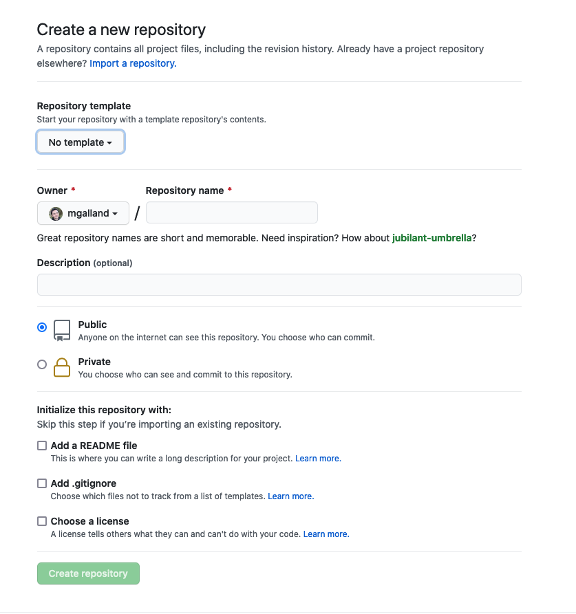

Add the required information, give a small description to your new repository, add a `.gitignore` file to ignore unnecessary files and add a license. 

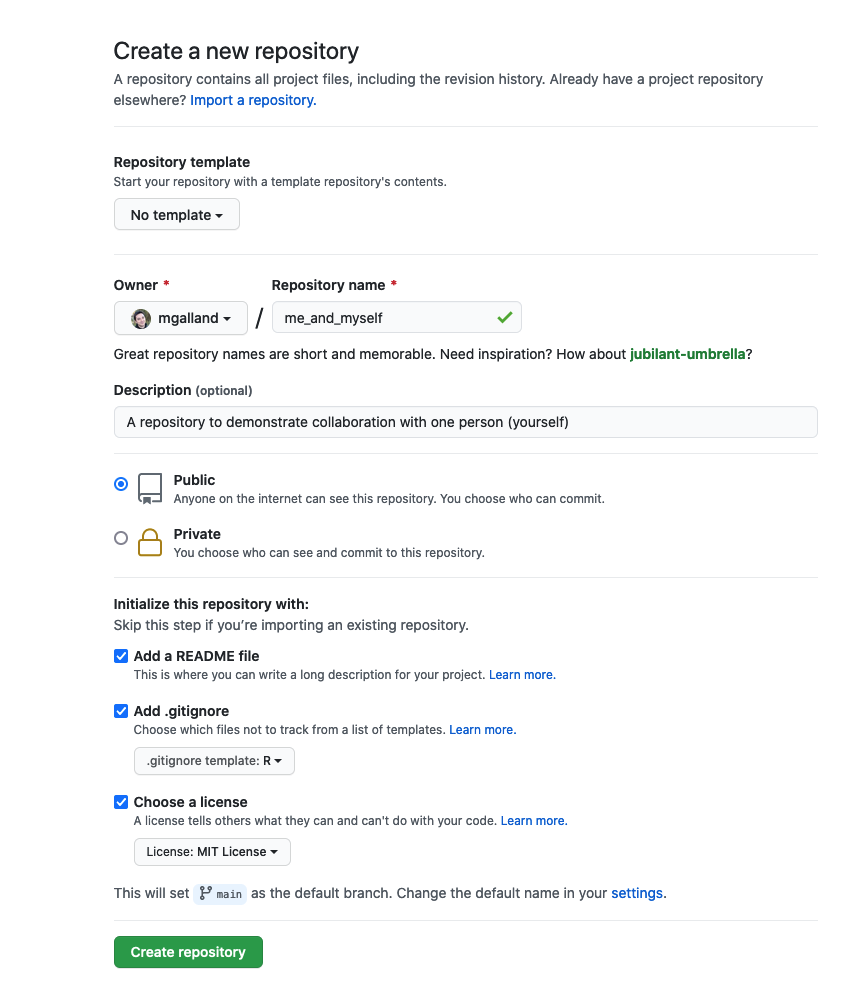

You can now see your new repository with a `LICENSE`, a `.gitignore` file and a `README.md` file. 

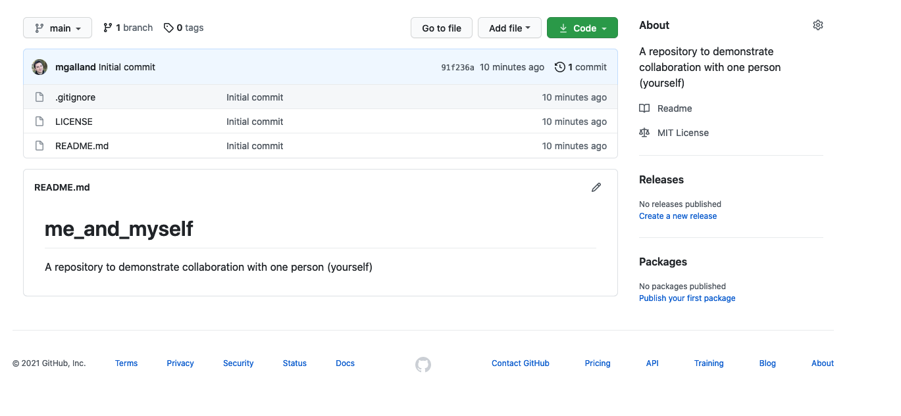

We are now going to clone this GitHub repository on our local computer from RStudio.

## 2.3 Create an RStudio project and clone this repository

Go to RStudio and click on _File > New Project_

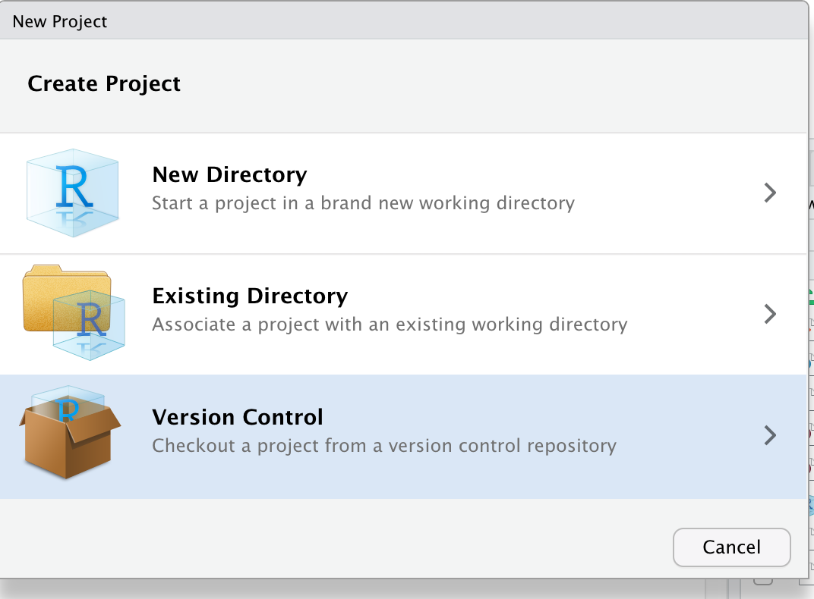

You are being asked to choose one version control system. Choose "git":

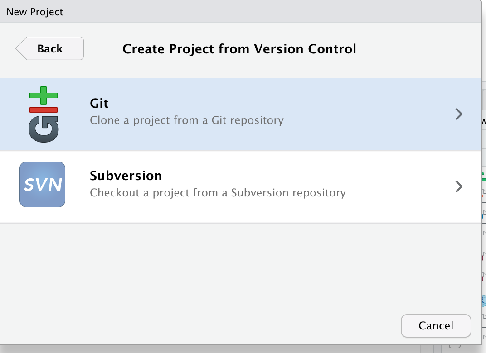

Finally, you can indicate from which remote repository you should start this new project. Go back online and copy-paste the link to your online repository. 

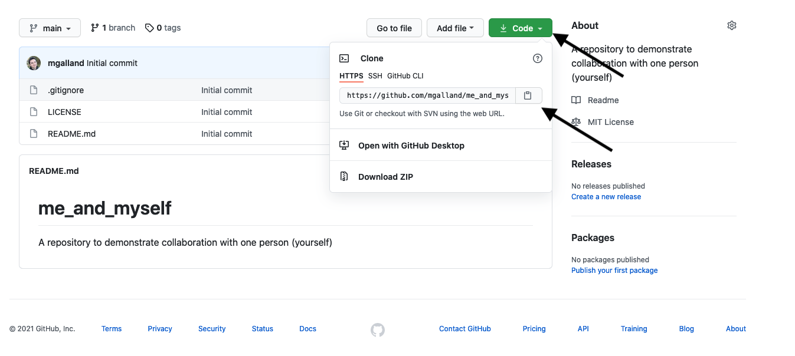

Finally, copy this information back in RStudio:

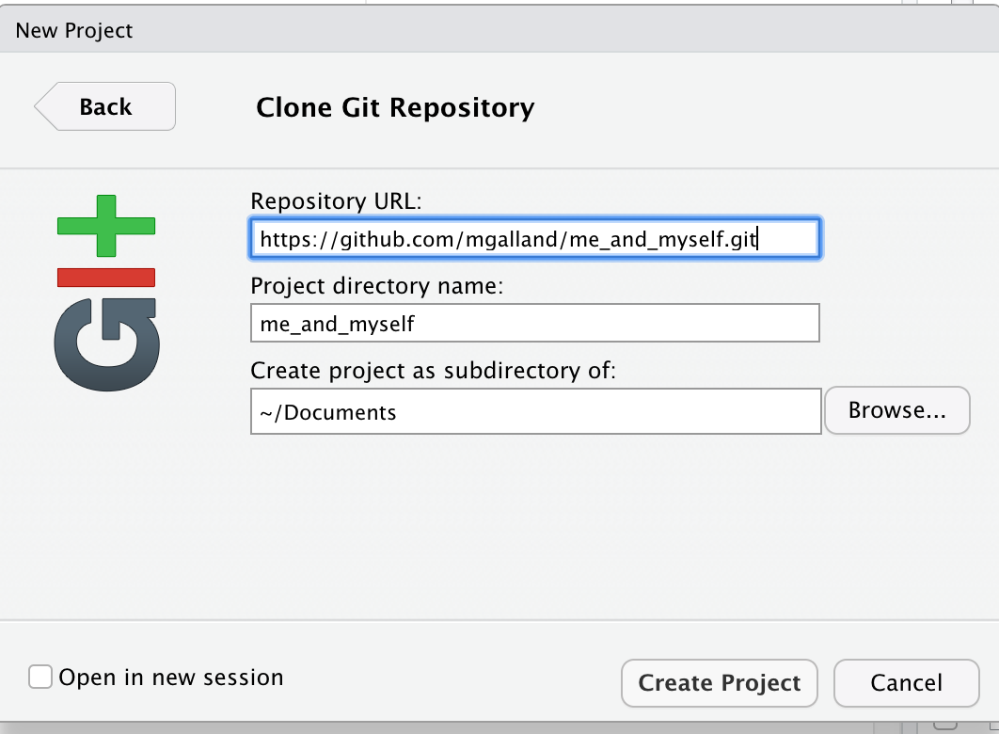

Your project is now ready to be imported from GitHub. If you do this, your local `git` and RStudio will be automatically configurated to work smoothly with the GitHub remote. 


## 2.4 Practice

> ## Exercise
> Using your recently acquired RStudio, dplyr and `git` knowledge, perform the following steps:
> * __Step 1:__ create a new R Markdown document and name it "gapminder.Rmd".  
> * __Step 2:__ add two code chunks. In the first one, import the tidy gapminder dataset. In the second one, create a plot of the GDP per year for your favorite country.    
>
> ~~~
> gapminder <- readr::read_csv('https://raw.githubusercontent.com/carpentries-incubator/open-science-with-r/gh-pages/data/gapminder.csv')
> ~~~
> {: .language-r}
> * __Step 3:__ save your "gapminder.Rmd" file. 
> * __Step 4:__ using RStudio, stage your changes to that file, make a commit with a message. 
> * __Step 5:__ push your changes online to GitHub. 
> * __Step 6:__ go online to GitHub and see if you can retrieve your commit. 
{: .challenge}

Your RStudio session should look like this. See the green "A" button that shows that your file has been brought to `git` attention.

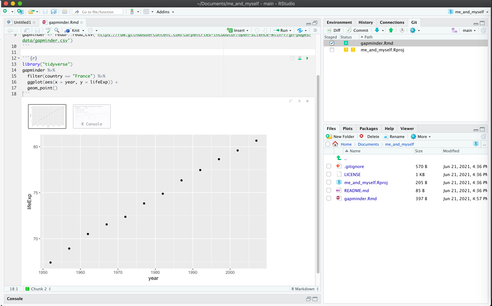

You should have made a commit message like this:

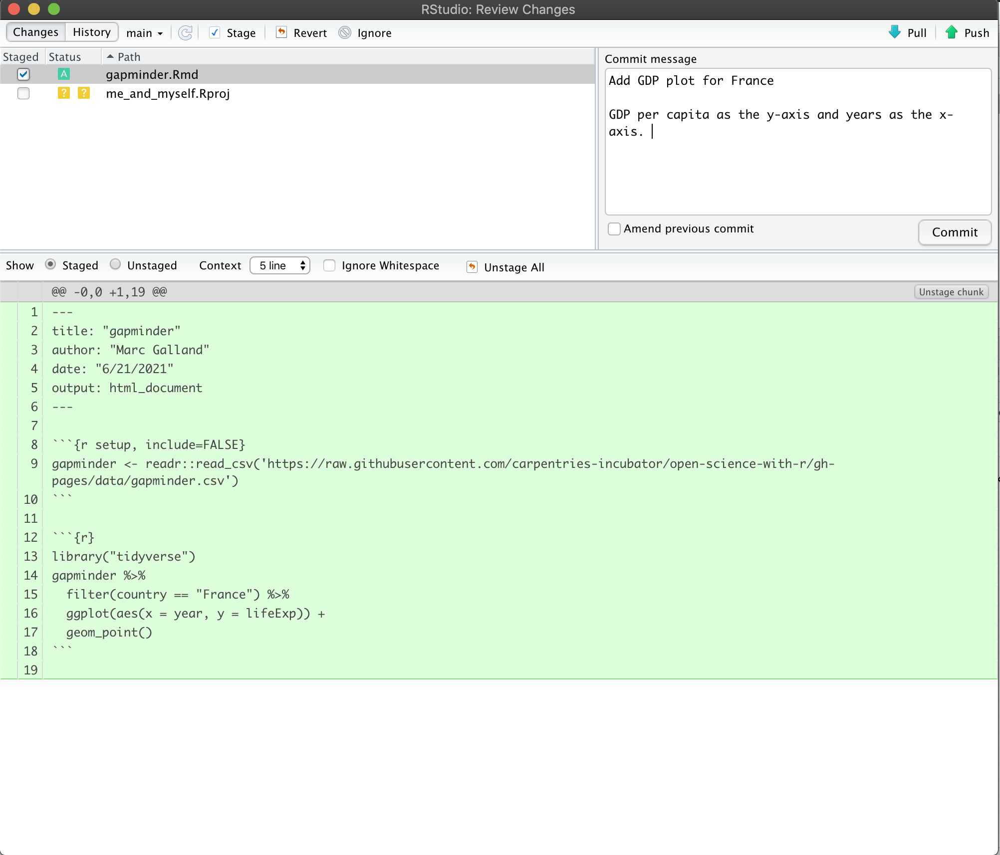

Finally click on "push" to update the GitHub online remote. 

> ## Question
> Can you find the commit id in your GitHub repository? 
{: .challenge}

Looking closely online, you see the commit identifier next to its time. 

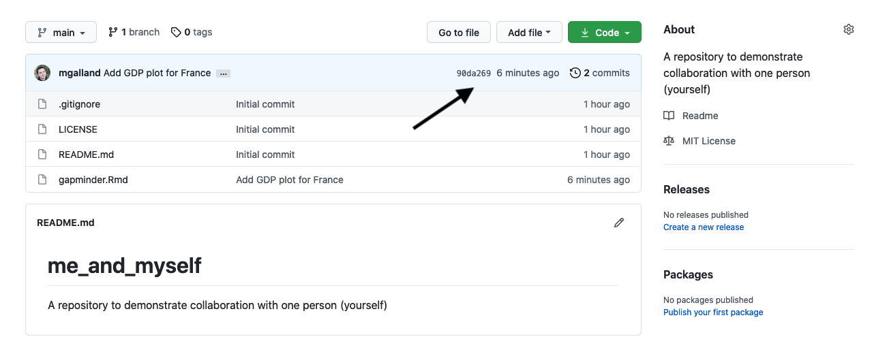

<br> 

# 3. Collaborating with others


The collaborative power of **GitHub** and **RStudio** is really game changing. So far we've been collaborating with our most important collaborator: ourselves. But, we are lucky that in science we have so many other collaborators, so let's learn how to accelerate our collaborations with them through GitHub.

We are going to teach you the simplest way to collaborate with someone, which is for both of you to have privileges to edit and add files to a repository. GitHub is built for software developer teams but we believe that it can also be beneficial to scientists.

We will do this all with a partner, and we'll walk through some things all together, and then give you a chance to work with your collaborator on your own.

## 3.1 Pair up and work collaboratively

1. Make groups of two scientists. They will collaborate through Github.
2. Decide who will own the Github repository: this will be the **"owner"** also referred to as **Partner 1**.
3. The other scientist will be called the **"collaborator"** also referred to as **Partner 2**.
4. Please write your role on a sticky note and place it on your laptop to remember who you are!  

## 3.2 Owner (Partner 1) setup

### 3.2.1 Create a Github repository

The repository "owner" will connect to Github and create a repository called **first-collaboration**. We will do this in the same way that we did in the ["Version control with git and Github" episode](https://scienceparkstudygroup.github.io/r-lesson-based-on-ohi-data-training/07-github/index.html).

### 3.2.2 Create a gh-pages branch

We aren't going to talk about branches very much, but they are a powerful feature of `git` and GitHub. I think of it as creating a copy of your work that becomes a parallel universe that you can modify safely because it's not affecting your original work. And then you can choose to merge the universes back together if and when you want.   
By default, when you create a new repo you begin with one branch, and it is named `master`. When you create new branches, you can name them whatever you want. However, if you name one `gh-pages` (all lowercase, with a `-` and no spaces), this will let you create a website. And that's our plan. So, owner/partner 1, please do this to create a `gh-pages` branch:

On the homepage for your repo on GitHub.com, click the button that says "Branch:master". Here, you can switch to another branch (right now there aren't any others besides `master`), or create one by typing a new name.


Let's type `gh-pages`.


Let's also change `gh-pages` to the default branch and delete the master branch: this will be a one-time-only thing that we do here:

First click to control branches:


And then click to change the default branch to `gh-pages`. I like to then delete the `master` branch when it has the little red trash can next to it. It will make you confirm that you really want to delete it, which I do!


## 3.3 Give your collaborator administration privileges (Partner 1 and 2)

Now, Partner 1, go into Settings > Collaborators > enter Partner 2's (your collaborator's) username.

Partner 2 then needs to check their email and accept as a collaborator. Notice that your collaborator has "Push access to the repository" (highlighted below):


## 3.4 Clone to a new Rproject (Owner Partner 1)

Now let's have Partner 1 clone the repository to their local computer. We'll do this through RStudio like we did before (see the ["Version control with git and Github:Clone your repository using RStudio" episode section](https://scienceparkstudygroup.github.io/r-lesson-based-on-ohi-data-training/07-github/index.html#clone-your-repository-usingrstudio). But, we'll do this with a final additional step before hitting the "Create Project": we will select "Open in a new Session".


Opening this Project in a new Session opens up a new world of awesomeness from RStudio. Having different RStudio project sessions allows you to keep your work separate and organized. So you can collaborate with this collaborator on this repository while also working on your other repository from this morning. I tend to have a lot of projects going at one time:


Have a look in your git tab.

Like we saw earlier, when you first clone a repo through RStudio, RStudio will add an `.Rproj` file to your repo. And if you didn't add a `.gitignore` file when you originally created the repo on GitHub.com, RStudio will also add this for you. So, Partner 1, let's go ahead and sync this back to GitHub.com.

Remember:


Let's confirm that this was synced by looking at GitHub.com again. You may have to refresh the page, but you should see this commit where you added the `.Rproj` file.

## 3.5 Collaborator (Partner 2) part

### 3.5.1 Clone to a new Rproject  (Partner 2)

Now it's Partner 2's turn! Partner 2, clone this repository following the same steps that Partner 1 just did. When you clone it, RStudio should not create any new files — why? Partner 1 already created and pushed the `.Rproj` and `.gitignore` files so they already exist in the repo.  

> ## Discussion point
>
> **Question**: When you clone it, RStudio should not create any new files — why?
>
> > ## Solution
> > Partner 1 already created and pushed the `.Rproj` and `.gitignore` files so they already exist in the repo.
> >
>{: .solution}
{: .discussion}

### 3.5.2 Edit a file and sync (Partner 2)

Let's have Partner 2 add some information to the README.md. Let's have them write:
```
Collaborators:

- Partner 2's name
```
{:.source}

When we save the README.md, And now let's sync back to GitHub.


When we inspect on GitHub.com, click to view all the commits, you'll see commits logged from both Partner 1 and 2!


> ## Discussion point
>
> **Questions**:
> 1. Would you be able to clone a repository that you are not a collaborator on?
> 2. What do you think would happen? Try it!
> 3. Can you sync back?
>
> > ## Solution
> > 1. Yes, you can clone a repository that is publicly available.
> > 2. If you try to clone it on your local machine, it does work.
> > 3. Unfortunately, if you don't have write permissions, you cannot contribute. You would have to ask for write/push writes.  
>{: .solution}
{: .discussion}

## 3.6 State of the Repository

OK, so where do things stand right now? GitHub.com has the most recent versions of all the repository's files. Partner 2 also has these most recent versions locally. How about Partner 1?

*Partner 1 does not have the most recent versions of everything on their computer!.*

> ## Discussion point
>
> **Question**: How can we change that? Or how could we even check?
>
> > ## Solution
> > Use the `pull` command to update your local version of the remote repository.
>{: .solution}
{: .discussion}

Let's have Partner 1 go back to RStudio and Pull. If their files aren't up-to-date, this will pull the most recent versions to their local computer. And if they already did have the most recent versions? Well, pulling doesn't cost anything (other than an internet connection), so if everything is up-to-date, pulling is fine too.

I recommend pulling every time you come back to a collaborative repository. Whether you haven't opened RStudio in a month or you've just been away for a lunch break, `pull`. It might not be necessary, but it can save a lot of heartache later.

<br> 

# 4. Merge conflicts

What kind of heartache are we talking about? Let's explore.    

> ## Stop and watch: demo time
> **Stop and watch me create and solve a merge conflict with my Partner 2, and then you will have time to recreate this with your partner.**
{: .callout}

## 4.1 Demo

Within a file, GitHub tracks changes line-by-line. So you can also have collaborators working on different lines within the same file and GitHub will be able to weave those changes into each other -- that's it's job! It's when you have collaborators working on *the same lines within the same file* that you can have **merge conflicts**. Merge conflicts can be frustrating, but they are actually trying to help you (kind of like R's error messages). They occur when GitHub can't make a decision about what should be on a particular line and needs a human (you) to decide. And this is good -- you don't want GitHub to decide for you, it's important that you make that decision.

Me = partner 1.
My co-instructor = partner 2.   

Here's what me and my collaborator are going to do:
1. My collaborator and me are first going to pull.
2. Then, my collaborator and me navigate to the README file within RStudio.
3. My collaborator and me are going to write something *in the same file on the same line*. We are going to write something in the README file on line 7: for instance, "I prefer R" and "I prefer Python".   
4. Save the README file.  
5. My collaborator is going to pull, stage, commit and push.
6. When my collaborator is done, I am going to pull.
7. Error! Merge conflict!


I am not allowed to to pull since GitHub is protecting me because if I did successfully pull, my work would be overwritten by whatever my collaborator had written.  
GitHub is going to make a human (me in this case) decide. GitHub says, "either commit this work first, or stash it". Stashing means " ("save a copy of the README in another folder somewhere outside of this GitHub repository").

Let's follow their advice and have me to commit first. Great. Now let's pull again.

Still not happy!


<!--
Let's have both Partners 1 and 2 go to RStudio and pull so you have the most recent versions of all your files. Now, Partners 1 and 2, both go to the README, and on Line 7, write something, anything. I'm not going to give any examples because I want both Partners to write something different. And be sure to save the README.
OK. Now, let's have Partner 2 sync: pull, stage, commit, push. Great.
Now, when Partner 2 is done, let's have Partner 1 (me) try.
Partner 1: pull ---- Error! Merge conflict! -->

OK, actually, we're just moving along this same problem that we know that we've created: Both me and my collaborator have both added new information to the same line. You can see that the pop-up box is saying that there is a CONFLICT and the merge has not happened. OK. We can close that window and inspect.

Notice that in the git tab, there are orange `U`s; this means that there is an unresolved conflict, and it is not staged with a check anymore because modifications have occurred to the file since it has been staged.

Let's look at the README file itself. We got a preview in the diff pane that there is some new text going on in our README file:

~~~
<<<<<<< HEAD
Julie is collaborating on this README.
=======
**Jamie is adding lines here.**
>>>>>>> 05a189b23372f0bdb5b42630f8cb318003cee19b
~~~
{: .source}

In this example, I am Jamie and my collaborator is Julie. GitHub is displaying the line that Julie wrote and the line Jamie wrote separated by `=======`. So these are the two choices that Partner 2 has to decide between, which one do you want to keep? Where where does this decision start and end? The lines are bounded by `<<<<<<<HEAD` and `>>>>>>>long commit identifier`.

So, to resolve this merge conflict, my collaborator has to chose, and delete everything except the line they want. So, they will delete the `<<<<<<HEAD`, `=====`, `>>>>long commit identifier` and one of the lines that they don't want to keep.

Do that, and let's try again. In this example, we've kept my (Jamie's) line:


Then be I need to stage and write a commit message. I often write "resolving merge conflict" or something so I know what I was up to. When I stage the file, notice how now my edits look like a simple line replacement (compare with the image above before it was re-staged):


## 4.2 Your turn

> ## Exercise
> 1. Create a merge conflict with your partner, like we did in the example above.
> 2. Try to fix it.
> 3. Try other ways to get and solve merge conflicts. For example, when you get the following error message, try both ways (commit or stash. Stash means copy/move it somewhere else, for example, on your Desktop temporarily).
>
{: .challenge}


## 4.3 Avoiding merge conflicts

One way to avoid merge conflicts is to `pull` often, `commit` and `push` often.

Also, talk with your collaborators. Even on a very collaborative project (e.g. a scientific publication), you are actually rarely working on the exact same file at any given time. And if you are, make sure you talk in-person or through chat applications (Slack, Gitter, Whatsapp, etc.).  

But merge conflicts will occur and some of them will be heartbreaking and demoralizing. They happen to me when I collaborate with myself between my work computer and laptop. So protect yourself by pulling and syncing often!

## 4.4 Create your collaborative website

OK. Let's have Partner 2 create a new RMarkdown file. Here's what they will do:

1. Pull!
2. Create a new RMarkdown file **and name it `index.Rmd`**. Make sure it's all lowercase, and named `index.Rmd`. This will be the homepage for our website!
3. Maybe change the title inside the Rmd, call it "Our website"
4. Knit!
5. Save and sync your .Rmd and your .html files: pull, stage, commit, pull, push.
6. Go to GitHub.com and go to your rendered website! Where is it? Figure out your website's url from your github repo's url. For example:
    - my github repo: <https://github.com/jules32/collab-research>
    - my website url: <https://jules32.github.io/collab-research/>
    - note that the url starts with my **username.github.io**

So cool! On websites, if something is called `index.html`, that defaults to the home page. So <https://jules32.github.io/collab-research/> is the same as <https://jules32.github.io/collab-research/index.html>. If you name your RMarkdown file `my_research.Rmd`, the url will become <https://jules32.github.io/collab-research/my_research.html>.

## Your turn

> ## Exercise
> Here is some collaborative analysis you can do on your own. We'll be playing around > with airline flights data, so let's get setup a bit.
> 1. Person 1: clean up the README to say something about you two, the authors.
> 2. Person 2: edit the `index.Rmd` or create a new RMarkdown file: maybe add something about the authors, and knit it.
> 3. Both of you: sync to GitHub.com (pull, stage, commit, push).
> 4. Both of you: once you've both synced (talk to each other about it!), pull again. You should see each others' work on your computer.
> 5. Person 1: in the RMarkdown file, add a bit of the plan. We'll be exploring the `nycflights13` dataset. This is data on flights departing New York City in 2013.
> 6. Person 2: in the README, add a bit of the plan.
> 7. Both of you: sync
{: .challenge}


# 5. Explore on GitHub.com

Now, let's look at the repo again on GitHub.com. You'll see those new files appear, and the commit history has increased.

## 5.1 Commit History

You'll see that the number of commits for the repo has increased, let's have a look. You can see the history of both of you.

## 5.2 Blame

Now let's look at a single file, starting with the README file. We've explored the "Raw" and "History" options in the top-right of the file, but we haven't really explored the "Blame" option. Let's look now. Blame shows you line-by-line who authored the most recent version of the file you see. This is super useful if you're trying to understand logic; you know who to ask for questions or attribute credit.

## 5.3 Issues

Now let's have a look at issues. This is a way you can communicate to others about plans for the repo, questions, etc. Note that issues are public if the repository is public.


Let's create a new issue with the title "NYC flights".

In the text box, let's write a note to our collaborator. You can use the *Markdown* syntax in this text box, which means all of your header and bullet formatting will come through. You can also select these options by clicking them just above the text box.

Let's have one of you write something here. I'm going to write:

~~~
Hi @jafflerbach!

# first priority

- explore NYC flights
- plot interesting things
~~~
{: .source}

Note that I have my collaborator's GitHub name with a `@` symbol. This is going to email her directly so that she sees this issue. I can click the "Preview" button at the top left of the text box to see how this will look rendered in Markdown. It looks good!

Now let's click submit new issue.

On the right side, there are a bunch of options for categorizing and organizing your issues. You and your collaborator may want to make some labels and timelines, depending on the project.

Another feature about issues is whether you want any notifications to this repository. Click where it says "Unwatch" up at the top. You'll see three options: "Not watching", "Watching", and "Ignoring". By default, you are watching these issues because you are a collaborator to the repository. But if you stop being a big contributor to this project, you may want to switch to "Not watching". Or, you may want to ask an outside person to watch the issues. Or you may want to watch another repo yourself!


Let's have Person 2 respond to the issue affirming the plan.

## 5.4 NYC flights exploration

Let's continue this workflow with your collaborator, syncing to GitHub often and practicing what we've learned so far. We will get started together and then you and your collaborator will work on your own.

Here's what we'll be doing (from [R for Data Science's Transform Chapter](http://r4ds.had.co.nz/transform.html)):

**Data**: You will be exploring a dataset on flights departing New York City in 2013. These data are actually in a package called `nycflights13`, so we can load them the way we would any other package.

Let's have Person 1 write this in the RMarkdown document (Partner 2 just listen for a moment; we will sync this to you in a moment).

~~~
library(nycflights13) # install.packages('nycflights13')
library(tidyverse)
~~~
{:.language-r}

This data frame contains all flights that departed from New York City in 2013. The data comes from the US [Bureau of Transportation Statistics](http://www.transtats.bts.gov/DatabaseInfo.asp?DB_ID=120&Link=0), and is documented in `?flights`.

~~~
flights
~~~
{:.language-r}

Let's select all flights on January 1st with:

~~~
filter(flights, month == 1, day == 1)
~~~
{:.language-r}

To use filtering effectively, you have to know how to select the observations that you want using the comparison operators. R provides the standard suite: `>`, `>=`, `<`, `<=`, `!=` (not equal), and `==` (equal). We learned these operations yesterday. But there are a few others to learn as well.

#### Sync

Sync this RMarkdown back to GitHub so that your collaborator has access to all these notes.

### Partner 2 pull
Now is the time to pull.  

Partner 2 will continue with the following notes and instructions:

### Logical operators

Multiple arguments to `filter()` are combined with "and": every expression must be true in order for a row to be included in the output. For other types of combinations, you'll need to use Boolean operators yourself:

- `&` is "and"
- `|` is "or"
- `!` is "not"

Let's have a look:

The following code finds all flights that departed in November or December:

~~~
filter(flights, month == 11 | month == 12)
~~~
{: .language-r}

The order of operations doesn't work like English. You can't write `filter(flights, month == 11 | 12)`, which you might literally translate into  "finds all flights that departed in November or December". Instead it finds all months that equal `11 | 12`, an expression that evaluates to `TRUE`. In a numeric context (like here), `TRUE` becomes one, so this finds all flights in January, not November or December. This is quite confusing!

A useful short-hand for this problem is `x %in% y`. This will select every row where `x` is one of the values in `y`. We could use it to rewrite the code above:

~~~
nov_dec <- filter(flights, month %in% c(11, 12))
~~~
{: .language-r}

Sometimes you can simplify complicated subsetting by remembering De Morgan's law: `!(x & y)` is the same as `!x | !y`, and `!(x | y)` is the same as `!x & !y`. For example, if you wanted to find flights that weren't delayed (on arrival or departure) by more than two hours, you could use either of the following two filters:

~~~
filter(flights, !(arr_delay > 120 | dep_delay > 120))
filter(flights, arr_delay <= 120, dep_delay <= 120)
~~~
{: .language-r}

Whenever you start using complicated, multipart expressions in `filter()`, consider making them explicit variables instead. That makes it much easier to check your work.

### Partner 2 sync
Once you have filtered the `flights` dataframe for flights, sync it to Github (add, commit and push).

## Your turn
Based on what you've learned previously about data transformation, you'll make a series of data transformation on the `flights` dataset. Some ideas:
* calculate the average flight delay.
* determine the longest flight distance.
* Your own question!

> ## Exercise
> Partner 1 will pull so that we all have the most current information.
> With your partner, transform and compute several metrics about the data.
> Partner 1 and 2, make sure you talk to each other and decide on who does what.
> Remember to make your commit messages useful!
> As you work, you may get merge conflicts. This is part of collaborating in GitHub; we will walk through and help you with these and also teach the whole group.
{: .challenge}


# 6. Resources and credits

## 6.1 Useful links
* [Creating a GitHub organization for a research lab](https://ourcodingclub.github.io/tutorials/git-for-labs/)
* [Connecting a local `git` folder to an existing GitHub remote](https://cfss.uchicago.edu/setup/git-with-rstudio/)

## 6.2 Icons

<div>Icons made by <a href="" title="Vectors Market">Vectors Market</a> from <a href="https://www.flaticon.com/" title="Flaticon">www.flaticon.com</a></div>

<div>Icons made by <a href="https://www.freepik.com" title="Freepik">Freepik</a> from <a href="https://www.flaticon.com/" title="Flaticon">www.flaticon.com</a></div>

<div>Icons made by <a href="https://www.flaticon.com/authors/smashicons" title="Smashicons">Smashicons</a> from <a href="https://www.flaticon.com/" title="Flaticon">www.flaticon.com</a></div>

<div>Icons made by <a href="https://www.freepik.com" title="Freepik">Freepik</a> from <a href="https://www.flaticon.com/" title="Flaticon">www.flaticon.com</a></div>

<div>Icons made by <a href="https://www.freepik.com" title="Freepik">Freepik</a> from <a href="https://www.flaticon.com/" title="Flaticon">www.flaticon.com</a></div>